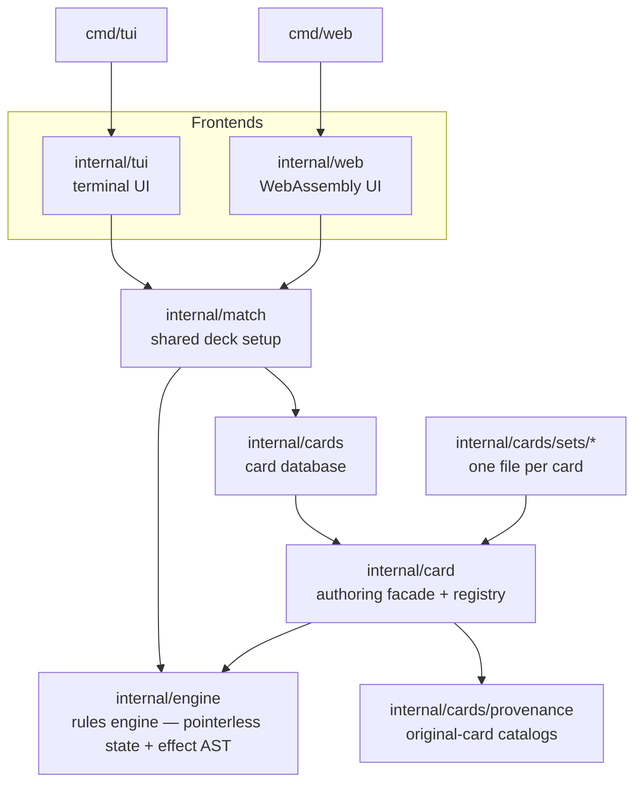

# Vactrol architecture

This document explains how the Vactrol codebase fits together — first at a
**high level** (the big pieces and why they are shaped the way they are), then
at a **medium level** (per-area responsibilities, the key types, and how a turn
and an ability actually flow through the code).

It is the human-facing companion to three other kinds of docs:

- **`AGENTS.md` files** (root, `internal/engine`, `internal/cards`) are the
  contributor/agent rules — the conventions to follow when changing code.
- **`docs/rulebook.md`** (generated) is the _game_ rules the engine implements.
- **`CONTEXT.md`** is the glossary; **`docs/roadmap.md`** and **`docs/todo.md`**
  cover long-term direction and planning. See **`docs/README.md`** for a full
  index of the documentation.

When this doc and an `AGENTS.md` overlap, the `AGENTS.md` is authoritative for
"how to write the code"; this doc is authoritative for "how the system is laid
out."

## 1. What Vactrol is

Vactrol is a rules engine for a KeyForge-style two-player card game, plus the
frontends that let you play it. The design is organized around two invariants
that almost every other decision follows from:

1. **The game state is a flat, pointerless value.** `GameState` is a struct of
   fixed-size arrays — no pointers, slices, or maps — so copying it is a cheap
   value copy with no allocation. That makes cloning a position (for AI search
   such as MCTS) essentially free, and keeps the engine easy to reason about.
2. **A card's rules text and its behavior come from one source.** Every card
   ability is a small tree of `Effect` nodes (an interpreter AST); each node both
   renders its own English text and carries itself out. Printed card text can
   therefore never drift from what a card actually does.

Everything else — the authoring facade, the frontends, the generated docs — hangs
off those two ideas.

## 2. The big picture

The arrows point in the direction of dependency. The key rule: **`engine` depends
on nothing upward.** It never imports the card database, the facade, or a
frontend, which is what keeps it pure and 100%-testable in isolation. The
`internal/card` facade sits _between_ card authors and the engine so card files
never import `engine` directly.

## 3. Package map

| Package                     | Responsibility                                                                                                                                          |
| --------------------------- | ------------------------------------------------------------------------------------------------------------------------------------------------------- |
| `internal/engine`           | The rules engine: flat `GameState`, the `Game` runtime, combat/turn/economy logic, and the `Effect` AST. Pure and clone-friendly.                       |
| `internal/card`             | Authoring **facade** over the engine (grouped namespaces like `card.House.Brobnar`, `card.Target.EachEnemyCreature`) plus the global card **registry**. |
| `internal/cards`            | Card-database **aggregator**: blank-imports every set so its cards self-register, and exposes `cards.All()`.                                            |
| `internal/cards/sets/<set>` | One self-registering file per card (e.g. `callofthearchons/anger.go`).                                                                                  |
| `internal/cards/cardtest`   | Declarative test harness (`ct.Play`, `ct.Side`, `h.Expect`) shared by the set packages.                                                                 |
| `internal/cards/provenance` | Embedded catalogs of the original KeyForge cards; links each Vactrol card to its source.                                                                |
| `internal/match`            | Shared match setup (random three-house decks, opening hands) used by every frontend.                                                                    |
| `internal/tui`              | Bubble Tea terminal UI.                                                                                                                                 |
| `internal/web`              | go-app WebAssembly client.                                                                                                                              |
| `cmd/tui`, `cmd/web`        | Thin binaries that wire up a frontend.                                                                                                                  |
| `magefiles/`                | Build/test/lint/codegen targets (`mage …`), including the comment/rulebook generators.                                                                  |

## 4. The core model (medium level)

Four types carry the whole engine:

- **`GameState`** (`state.go`) — the complete mutable state as a flat value:
  fixed `[maxCards]CardCore` for per-card in-play state, and per-player zone lists
  (battleline, hand, deck, discard, artifacts, archives, purge) plus pools, keys,
  and turn flags. Each zone is sized to its own bound — deck-bounded zones hold 36
  cards, zones that can hold both decks (battle line, artifact row, archives) hold
  72. `GameState.FastCopy()` is a plain value copy. No pointers/slices/
  maps live here — that constraint is load-bearing (see `internal/engine/AGENTS.md`).
- **`LocalID`** (`uint8`) — a card's identity within one match. Everything in
  `GameState` refers to cards by `LocalID`, never by pointer.
- **`catalog`** — the read-only registry of `*CardDefinition` for a match, held
  _separately_ from `GameState` (definitions never change during play, so clones
  share one catalog). `catalog.add` guards the `maxCards` cap so overflow fails
  loudly rather than corrupting ids.
- **`Game`** (`game.go` + `game_*.go`) — the live-match harness: it wraps a
  `GameState` and a catalog with the surrounding services (player names, the
  per-player `Chooser`, RNG, and the log) and hosts the turn/combat/economy
  methods. `Game` methods are split across `game_*.go` files by area
  (`game_turn.go`, `game_combat.go`, `game_leaves_play.go`, …).

## 5. The effect AST and the `Resolver` port

A card ability is a tree of **`Effect`** nodes (`effect.go`, `effect_*.go`). Every
node implements two methods:

- `Text() string` — renders the node's KeyForge English.
- `Resolve(ctx *EffectContext)` — carries the node out against the live game.

Composite nodes (`Sequence`, `Conditional`, `ChooseHouseThen`, …) hold child
effects, so complex cards are built by composition rather than one bespoke node.

Crucially, an effect never touches `Game` or `GameState` directly. It reaches the
engine only through the **`Resolver`** interface (`resolver.go`) carried on its
`EffectContext`. `Resolver` is the complete, auditable catalogue of what a card is
allowed to do, composed from focused role interfaces (`StateReader`,
`EconomyResolver`, `CreatureResolver`, `CombatResolver`, `ZoneResolver`,
`TurnResolver`, `ChoiceResolver`, `Logger`). `*Game` implements it. This is a
Ports-and-Adapters split: the effect AST is the domain, `Resolver` is the port,
`*Game` is the adapter.

Behavior that varies along an axis is modeled as a small **strategy** that also
renders its own text, so it plugs into the AST without desync:

- **`Chooser`** makes a player's decisions (swapped per frontend); its optional
  capabilities `OptionChooser` / `Orderer` are discovered by type assertion.
- **`Target`** names the cards an effect applies to (a base kind plus filters);
  **`Selector`** refines a target set relative to itself ("except the most
  powerful").
- **`Count`** computes a board-scaled number; **`Condition`** is a branch
  predicate for `Conditional`.

For the full pattern rationale and the tradeoffs, see
[`internal/engine/AGENTS.md`](../internal/engine/AGENTS.md).

## 6. How a turn and an ability flow

**A turn** (driven by a frontend): `StartTurn(p)` readies the player, forges a key
if affordable, and promotes any armed "next turn" effects; the player chooses an
active house (`ChooseHouse`) and then plays cards / reaps / fights / uses actions
through `Game` methods; `EndPlayPhase(p)` runs the ready phase, which clears
turn-scoped state, and the phases that follow it. Wins are checked after
`StartTurn`.

**An ability** (e.g. a creature's "Play:"): the `Game` method that triggers it
builds a fresh `EffectContext` (with the `Resolver`, the source card, and the
controller), then calls the ability effect's `Resolve`. The effect reads/writes
only through the `Resolver`, asks the controller's `Chooser` for any decisions,
and — when one step produces a value a later step consumes ("... this way"
counts) — records it on `ctx.Produced` for the next effect to read. Each ability
gets its own context, so those tallies never leak between abilities.

**"For the remainder of the turn" effects** (Full Moon, Charge!, Dimension Door)
can't store a closure in the flat state, so they route through a small flat
registry (`game_lasting.go`): a reaction re-fires on a later event, or a
replacement changes an event's outcome. Event sites emit one dispatch and let the
active player order simultaneous triggers — the play/reap hot path never grows a
special case per card.

## 7. Card authoring and generated docs

Cards are written against the **`card` facade**, not the engine. `card.New(...)`
builds a `CardDefinition` and self-registers it in a global registry; each card is
a package-level `var` in a set package, and the `cards` aggregator blank-imports
every set so importing `cards` pulls them all in. A card tags its origin with
`card.Provenance(...)`, linking it to the original-card catalogs in
`internal/cards/provenance`.

Two generators keep prose in sync with code (run via `mage gen`):

- **`gencomments`** rewrites each card's doc comment (and its test's) from the
  card definition, so the comment always mirrors the rendered card box.
- **`genrules`** builds `docs/rulebook.md` from `//rulebook:` directives in engine
  doc comments, so the rulebook stays next to the code it describes.

Authoring conventions (file layout, the multiline struct style, wording rules)
live in [`internal/cards/AGENTS.md`](../internal/cards/AGENTS.md).

## 8. Frontends and the chooser bridge

Both frontends build a game through `internal/match` (`match.New` deals two random
three-house decks deterministically from a seed) and then install their own
`Chooser`. The engine's `Chooser` is **synchronous** (an effect calls it and
blocks on the answer), but both UIs have a single event loop that must not block —
so each wraps the engine call in a background goroutine and bridges the choice
back to the UI thread (the TUI via Bubble Tea messages, the web via go-app
dispatches). Rendering is intentionally _not_ shared — terminal cells and HTML are
different enough that only the setup (`match`) is common.

Planned frontends (an MCTS bot, a lobby server) are expected to be new `cmd/…`
binaries and `internal/…` packages on the same engine; the pointerless state and
the segregated `Resolver` are what make those feasible without touching the core.

## 9. Quality gates

- `mage check` is the full green gate: `fmt-check`, `build`, `vet`, `lint`
  (golangci-lint, pinned), `test`, and `cover`.
- **`internal/engine` is held at 100% statement coverage** — it is where the value
  and the risk concentrate, and it has no UI/IO to dilute the measurement. A new
  engine code path needs an engine test.
- Card behavior is pinned by per-card tests on the `cardtest` harness; those also
  guard the generated card text, which makes composability refactors safe.

For the testing options, when to reach for each, and what to test at each layer,
see [testing.md](testing.md).
