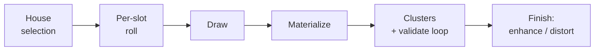

# Deck generation

This document explains **how Vactrol builds a deck** — the philosophy behind the
procedural generator, the pipeline it runs, and the tunable knobs that shape the
result. It is the narrative companion to the more formal records:

- **`CONTEXT.md`** (repo root) is the glossary — what each term (House pod, Slot,
  Maverick, Legacy, Rating, …) precisely means.
- **`docs/adr/0003-deckgen-inverted-dependency.md`** records _why_ generation is a
  pure function living below the card facade.
- **`docs/adr/0004-template-materialize-seam.md`** records _why_ some cards stay
  parameterized blueprints until generation time.
- **`docs/architecture.md`** covers how the engine and card database fit together.

> **Status: design, not yet built.** Today `internal/match` just repeats a house
> pool and shuffles. Everything below is the intended design; treat it as the plan
> the implementation should follow, not a description of existing code.

## 1. Philosophy

A KeyForge-style deck is not a pile of random cards — it is a _procedurally
generated artifact_ with structure and flavor. A few principles drive every
decision here:

- **Procedural, not arbitrary.** A deck is 3 House pods of 12 cards, assembled by
  rules that mirror how KeyForge decks feel: mostly on-House commons, a spine of
  uncommons and rares, the occasional maverick or legacy card, a rare special, a
  scattering of enhancements.
- **Deterministic.** The same Set and seed always produce the same deck (within a
  single version of the Set's card pool). This makes decks reproducible and,
  eventually, warehouseable.
- **True-random by default.** Generation does not try to make "good" decks. It
  samples honestly from the Set. Steering decks toward a power band is an _opt-in_
  layer (see §6), not the baseline.
- **Rarity is the only knob; card-type mix is emergent.** We target the _rarity_
  distribution (≈18 common / 12 uncommon / 6 rare) and let the _type_ mix
  (creatures / actions / artifacts / upgrades) fall out of how the Set's pools are
  composed. KeyForge added a type guard-rail; we deliberately do not — it flattens
  the natural variance that makes decks feel distinct.
- **Orthogonal to the engine.** The generator produces pure data; only
  `internal/match` ever pushes a finished deck into a live game. See ADR 0003.

## 2. Where it lives

Generation is a package, `internal/deckgen`, that depends **only on the engine's
data types** — `House`, `CardType`, `Rarity`, `CardDefinition` — never the `Game`
runtime, never the card facade, never provenance. The dependency arrow is
inverted: `deckgen` defines the pure types (`Set`, `Deck`, `HousePod`, `Slot`, the
`Materializer` port), and the card database depends on `deckgen` to assemble a
`Set` and attach per-card generation metadata.

```text
cards → card → deckgen → engine
bot / scoring → deckgen
```

The public surface is a pure function:

```go
func Generate(set Set, seed int64) Deck
```

A `Set` is defined by the cards declared in one `internal/cards/sets/<slug>`
package — not by provenance, which is author-only coverage bookkeeping and is
never read here. Set membership is picked up automatically through a set-scoped
builder (a `0set.go` config file per set package); reprints — cards shared between
Sets — are declared by name and resolved centrally in the `cards` aggregator, so
no set package imports another.

## 3. The pipeline

Generation runs per deck as a sequence of passes. The spine is:



1. **House selection.** Draw 3 distinct Houses from the Set's selectable Houses,
   honoring exclusion constraints (in some Sets two Houses are mutually exclusive)
   and per-House weights (the draw need not be uniform). Rare whole-pod overlays
   also roll here — a _legacy House pod_ (same House, pool from another Set) or a
   _maverick House pod_ (a House not in this Set at all). Neither is implemented
   yet; when the maverick pod lands it must complete every `OnePerHouse` cluster to
   all nine Houses, since a maverick pod can drop a House the Set never printed a
   member for (see `docs/todo-agent.md`, "Maverick houses complete every
   OnePerHouse cycle").
2. **Per-slot roll.** For each of the 12 Slots in each pod, roll a rarity, then
   independent overlays for Special, Maverick, and Legacy (see §4).
3. **Draw.** Pull a card from the pool the rolls point at (House dimension × Set
   dimension × rarity), honoring one-copy-per-deck limits and the duplicate-pull
   bias.
4. **Materialize.** Compile the Slot to a concrete, engine-ready card: bind any
   template parameters, rehouse a maverick to the pod's House, and bind
   self-referential "your House" text to that House (see §5 and ADR 0004).
5. **Clusters + validate loop.** A drawn card may _pull_ a family of related cards
   into the pod. Resolve these, then validate; on failure, repair or reseed
   (see §5).
6. **Finish.** Once the deck is valid, run the deck-wide enhancement and
   distortion pass (see §5).

## 4. The distribution model

The heart of the design is that **independent per-slot rolls give the right
averages _and_ the right variance for free.**

- **Rarity.** Each Slot rolls Common / Uncommon / Rare with weights ≈
  `.50 / .333 / .167`. Per pod that averages 6 / 4 / 2; per deck, 18 / 12 / 6.
  Because the rolls are independent, each rarity's _count_ is binomially
  distributed — the mean is the target and the spread is a natural bell curve. A
  deck with 20 commons or 8 rares is possible, just unlikely, with no explicit
  distribution code.
- **Overlays.** Special, Maverick, and Legacy are independent per-slot coin flips
  layered on the rarity roll:
  - **Special** (`p ≈ 0.0024`) replaces the normal rarity draw with a houseless,
    very-rare card, stamped with the pod's House on landing. This yields roughly
    one special per twelve decks, with multiples genuinely rare.
  - **Maverick** (`p ≈ 1/12`, ≈3 per deck) draws from a _different same-Set
    House_ at the rolled rarity, then rehouses the card to the pod.
  - **Legacy** (`p ≈ 1/6`, ≈6 per deck) draws from the _same House in a different
    Set_ at the slot's rolled rarity, so a legacy card matches the rarity its
    slot would have drawn (falling back to any rarity of that House when it has
    no legacy card of that rarity).
  - **Legacy Maverick** needs no special handling — it is simply both flips firing
    on one Slot.
- **Duplicates.** Most real decks have a couple of duplicate cards. This is a
  draw modifier: when filling a Slot, with a per-rarity probability, copy a
  card already placed in the same pod at the same rarity instead of drawing fresh.
  Cards limited to one copy per deck are excluded as both source and target.

All of these live in a `Tuning` block with package-level defaults; a Set inherits
the defaults and overrides only what it wants to change.

## 5. Templates, clusters, and finishing

Three mechanisms handle the cards that ordinary drawing cannot express directly.

**Templates (materialize).** Some cards are not fully determined until generation:
a mutant composed from two Houses (7 home × 6 other = 42 outcomes), an enumerable
family like Master of 1/2/3 collapsed into one pool entry, or a maverick whose
text names its own House. These are authored as _templates_ — parameterized
blueprints that occupy one pool entry and expose a fixed face (House, Type, Rarity)
for bucketing, but defer their effects, name, and parameters to a per-Slot
`Materialize` step that produces a concrete, engine-ready card. The build logic
lives in the card layer and runs at generation time; it never enters the engine's
game state. This is the subject of ADR 0004.

**Clusters.** A card can pull a family of related cards into its pod: the four
Horsemen (a lead member pulls the whole family), Plague Rat (pulls a variable
number of copies of itself), a "sin" slot (a random count of distinct cards from
the seven sins), Timetraveller (pulls exactly one Help From Future Self per copy),
Troop Call (pulls a couple of Niffle Apes and, less often, a Niffle Queen). These
are all one mechanism — a **cluster**, a named family whose members share a
**strategy** (how it fills) and a **trigger** (what fires it). This is the subject
of ADR 0036, which replaced the earlier ad-hoc connection mechanism.

A card joins a cluster with `card.InCluster(cluster)`; the lead of a `ByLead`
cluster carries `card.LeadsCluster(cluster)`. All members share one declared
`card.Cluster` value, so their placement rules cannot drift. The strategies are:

- **OnePerHouse** — deck-wide: places one member in each of the deck's Houses when
  any member is drawn (the per-House Shards). It is gated complete-by-construction,
  so a set that can deck a House with no member fails the build.
- **WholePool** — places every member (the four Horsemen).
- **RandomCount** — places a random count of distinct members in `[Min, Max]` (the
  seven sins).
- **SelfPull** — places `Min + Poisson(Mean − Min)` copies of the single triggering
  member itself, capped at a full pod (Plague Rat pulls more Plague Rats).
- **PullExact** — places one copy of each non-lead member per lead instance, so N
  leads pull N partners (two Timetravellers pull two Help From Future Self). Always
  `ByLead`.
- **Pull** — places a per-partner `Min + Poisson(Mean − Min)` count of each non-lead
  member when the lead rolls in, each partner setting its own rate with
  `card.Pulled(cluster, min, mean)` (Troop Call pulls Niffle Apes at one rate, a
  Niffle Queen at a lower one). Always `ByLead`.

Each pod-local strategy tops the pod up by overwriting slots that hold no member of
the cluster, so the fired member and any siblings already placed stay put. A member
whose native House differs from the pod's is rehoused as a maverick — the same rule
KeyForge uses for a Maverick's family — so a Sanctum pod that mavericks in Troop
Call still gets its Niffle Apes, rehoused to Sanctum. Clusters are visited in name
order, so a set with several fills deterministically.

A pulled card is usually authored `card.Rarity.Connected`, which keeps it out of
the pool so it never rolls without its cluster — `NewSet` indexes Connected cards by
name only. That is not required, though: Troop Call guarantees Niffle Apes that also
roll on their own, which is how the card's flavour survives into deck generation.
`Set.validateClusters` fails the build if a cluster can never fire (every triggering
member is Connected, so nothing rollable places it) or, for OnePerHouse, if it
leaves a deckable House with no member. A pool distinct from a single named list
(drawing a "sin" from all seven) is the deferred axis.

**Deadlock.** Constraints can genuinely conflict — too many protected slots, or
mutually exclusive requirements. Rather than backtracking, the loop is capped at a
few repair attempts; on non-convergence the pod (or deck) is discarded and re-rolled
from a _derived_ sub-seed, so determinism is preserved. Authoring-time
contradictions (a one-copy card that also pulls copies of itself) are caught by a
static validator over the card database, not at generation time.

**Enhancements and distortions.** These are a **deck-wide finishing pass**, run
_after_ the deck is valid, because they redistribute across cards. A card may be an
enhancement _source_ — it declares bonuses (Æmber, capture, draw, …) it contributes
to a pool — and any card may be a _recipient_ of landed bonuses, up to five per card
including printed icons. A distortion weakens one card's property to strengthen the
same property on another, capped between -2 and +2. Because bonuses land per Slot,
two Slots holding the same card can legitimately diverge — the finished, playable
card is the base card plus what landed on it, not the base card alone.

## 6. Scoring and band-targeting

Deck rating is a separate concern that generation can _optionally_ consume. It lives
in its own package (`internal/scoring`) and is shared by two clients: the deck-rating
path and the procedural self-play **bot** (an MCTS player — heuristics and search,
not a generative model). Sharing means "how good is this card" has a single
definition.

- **The model is learned, not hand-typed.** Each card gets a capability _vector_,
  seeded from an analysis of its effect tree and refined by bot self-play. The model
  is a serializable, replaceable artifact, so the self-play loop can regenerate it.
- **Synergy is expressed with tags.** A card _provides_ and _consumes_ named synergy
  axes with weights; deck synergy is the weighted match of providers to consumers,
  and antisynergy is just a negative weight. This scales linearly with authoring and
  generalizes across Sets, unlike an N² table of card pairs.
- **A deck's Rating** is the aggregate of card values plus synergy contributions.

Targeting a Rating _band_ (say 80–90) is opt-in. The key realization is that
band-targeting is **rejection sampling from the Set's intrinsic Rating
distribution**: because generation is deterministic chaos, re-rolling from
`hash(seed, attempt+1)` is statistically identical to picking any fresh seed — there
is no "unlucky seed" to escape. So the approach is:

- Generate a full deck, finish it, and score it on the **authoritative post-finish**
  Rating (enhancements and connections change the score).
- If it is outside the band, **reject and regenerate**. We deliberately do _not_
  swap out the top or bottom cards — that would bias which cards and synergies
  survive.
- Optional **candidate steering** (draw _K_ candidates per Slot, keep the one whose
  marginal contribution moves toward the band) raises the in-band hit rate so
  rejection terminates quickly. `K = 1` is pure random — the default.

Whether a band is even reachable depends entirely on how much of the Set's rating
distribution overlaps it. So observability is first-class: the scorer exposes each
deck's Rating and a sampler that reports the mean, spread, and histogram over many
generated decks. If the attempt cap is exhausted, the failure is _diagnostic_ —
"band 80–90 unreachable; sampled μ=63, σ=7; raise K, widen the band, or retune the
Set" — never a bare error.

## 7. Determinism and warehousing

A deck is reproducible from `(Set, seed)` only **within one version of the Set's
pool**. Adding or changing cards changes the pools, so the same seed will produce a
different deck afterward. That is an accepted trade-off for a personal-scale project;
a content hash of the pool is a reserved option if stronger guarantees are ever
needed. The generator threads a single RNG in a fixed, test-locked draw order so a
refactor cannot silently reshuffle every deck.

## 8. Deferred and open

Intentionally out of scope for the first implementation, but the design leaves room
for each:

- **The houseless House** that Special cards belong to before placement — reserved
  in the pool model, inert until houseless cards exist.
- **Cross-pod maverick connections** — a tunable, off by default.
- **Engine support for distortions and non-Æmber enhancement bonuses** — the
  finishing pass is designed around them, but the engine does not model them yet.
- **The bot self-play loop** that refines the scoring model — the package seams are
  reserved so it can be added without touching `deckgen` or the engine.
