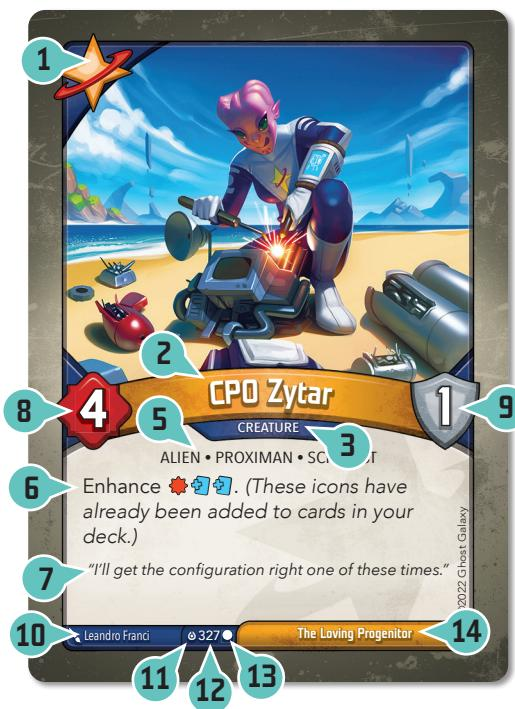
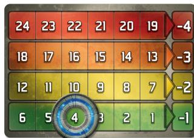
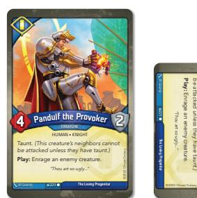
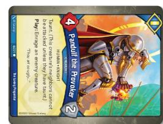

<!--
This document was converted from the official KeyForge Master Rulebook PDF and is
included here only as a reference. Do not edit it — it is not authoritative, and
any changes will be lost if it is regenerated from the source PDF.
-->

# CHANGE SUMMARY – JUNE 26, 2026

The _KeyForge Master Rulebook_ is the most comprehensive rules document for the game of KeyForge. It includes the complete rules of play, glossary of game terms, official errata, and a list of frequently asked questions to provide additional clarity and context for specific game situations.

# MASTER RULEBOOK

VERSION 18.4

# CONTENTS

- [WELCOME TO THE CRUCIBLE](#welcome-to-the-crucible)
- [GAME SETUP](#game-setup)
- [TURN SEQUENCE](#turn-sequence)
- [CARD ANATOMY](#card-anatomy)
- [GLOSSARY](#glossary)
- [ERRATA](#errata)
- [GENERAL FAQ](#general-faq)
- [CARD-SPECIFIC FAQ](#card-specific-faq)
- [APPENDIX: TIMING CHART](#appendix-timing-chart)

# WELCOME TO THE CRUCIBLE

_You are an Archon. Hailed by some as a god, respected by others for your wisdom, you were born—or perhaps created—on the Crucible, a world in which anything is possible._

The Crucible is ancient, but ever renewed. An artificial planet _hanging in the center of the universe, the Crucible's many layers remain constantly under construction by the enigmatic and mischievous Architects. For raw materials, the Architects have harvested countless worlds, blending them into a new whole both familiar and alien to the creatures that dwell there._

_Whether lone specimens or entire cultures, the beings brought_ to the Crucible find themselves in a strange wonderland with no _obvious means of returning to their former homes. Some thrive, building new societies and developing new technologies with the aid of the mysterious psychic substance known as Æmber. Some discard the trappings of their old lives, adopting the ways and customs of new tribes discovered in this new world. Others devolve, bodies and minds twisted beyond all recognition, incorporating Æmber into their very bodies._

_As an Archon, you have gathered followers in your journeys_ throughout the Crucible, allies who find value in your ageless _wisdom and your ability to speak to all creatures. With the aid of these allies, you seek out Vaults hidden throughout the Crucible by the cryptic Architects. Each Vault can only be unlocked by Æmber-forged keys. Once open, a Vault's contents—the power and knowledge of the Architects—can be consumed by only a single Archon._

_When two Archons discover a Vault, only one can gain its knowledge. Only one can move one step closer to the secret of the Crucible…_

_KeyForge_ is a two-player card game in which each player takes the role of an Archon, and leads that Archon's deck against their opponent.

A player's deck represents a team that is attempting to gain Æmber and forge keys. The first player to forge three keys is able to unlock a Vault and win the game.

The defining feature of _KeyForge_ is that no two decks are alike. _KeyForge_ cards are not sold individually; they are always sold as complete decks. Every deck in existence is unique!

## USING THIS DOCUMENT

If you have never played a game of _KeyForge_ before, start by reading the Learn to Play KeyForge document included in the starter set to learn the basics of the game.

The KeyForge Master Rulebook is the definitive source for all rules of play for the KeyForge card game. It includes a detailed turn sequence, card anatomy diagrams, a glossary of important game concepts and terminology, official errata, an extensive list of frequently asked questions, and timing charts.

If the KeyForge Master Rulebook contradicts the Learn to Play KeyForge book, the KeyForge Master Rulebook takes precedence.

All KeyForge rules documents can be viewed and downloaded at keyforging.com.

# GAME SETUP

To set up the game, perform the following steps, in order:

1. Place all damage tokens, Æmber tokens, and status counters in a common supply within easy reach of both players.
2. Each player places their Archon identity card to the left or right side of their play area.
3. Each player places three key tokens, one of each color, with the unforged side faceup near their Archon identity card.
4. Randomly determine who is the first player. That player takes the first turn when the game begins.
5. Each player shuffles their deck and offers it to the opponent for additional shuffling and/or a final cut.
6. The first player draws a starting hand of seven cards. The other player draws a starting hand of six cards.
7. Each player, starting with the first player, has one opportunity to mulligan their starting hand by shuffling it back into their deck and drawing a new starting hand with one fewer card.

# TURN SEQUENCE

The game is played over a series of turns. Players alternate taking turns until one player wins the game.

Each turn consists of five steps, which are described in the following sections:

1. Forge a key.
2. Choose a house.
3. Play, discard, and use cards of the chosen house.
4. Ready cards.
5. Draw cards.

The player taking a turn is referred to as the active player. The active player is the only player that can perform actions or make decisions; a player does not make any decisions when it is not their turn.

## STEP 1: FORGE A KEY

If the active player has enough Æmber to forge a key during this step, they must do so. To forge a key, the active player spends Æmber from their Æmber pool equal to their current key cost, then they flip any one of their key tokens to its forged side.

The default key cost is six Æmber (6). Some card abilities may increase or decrease this cost. Key cost cannot be less than zero.

No more than one key can be forged during this step each turn, even if the active player has enough Æmber to forge multiple keys.

Some cards have effects that allow Æmber on those cards to be spent when forging keys. If the active player controls such a card, the Æmber on it can be spent along with Æmber in the active player's Æmber pool, in any combination.

Spent Æmber is returned to the common supply.

A player immediately wins the game when they forge their third key.

## STEP 2: CHOOSE A HOUSE

Each _KeyForge_ deck is composed of three different houses, which are shown on the Archon identity card. During this step, the active player chooses one of the houses on their Archon identity card to be the active house for the remainder of the turn and announces the choice to their opponent. This active house determines which cards the active player can play, discard from their hand, and use this turn.

After choosing a house, the active player has the option to take all cards in their archives and add them to their hand.

If a player controls a card that does not belong to one of the three houses on their Archon identity card, they may (if they desire) choose and activate that house during this step instead of one of the three houses in their deck.

A player cannot choose to activate a house unless it is either on their Archon identity card or they control a card that belongs to that house. If a card effect instructs a player that they must activate a house other than one in the aforementioned categories, that card effect is ignored.

## STEP 3: PLAY, DISCARD, AND USE CARDS OF THE CHOSEN HOUSE

The active player may play or discard any number of action cards, artifacts, creatures, and upgrades of the active house from their hand and may use any number of cards of the active house that are in play under their control. Eligible cards may be played, used, or discarded in any order.

A card's house is determined by an icon in the upper-left corner. If the active house corresponds to a card's icon, that card is eligible to be played, used, or discarded.

The active player cannot play, use, or discard cards that aren't of the active house unless specified by a card ability.

Rules for playing, discarding, and using action cards, artifacts, creatures, and upgrades are described in each card type's glossary definition.

First Turn Rule: During the first player's first turn of the game, that player may only play or discard one card from their hand. Card effects can modify this rule.

## STEP 4: READY CARDS

The active player readies each of their exhausted cards, one at a time.

## STEP 5: DRAW CARDS

The active player draws cards from the top of their deck until they have six cards in their hand. After a player completes this step, their turn ends.

If the active player has more than six cards in hand, they do not discard down to six.

If a player needs to draw cards (during this step or at any other time) and cannot because their deck is empty, that player shuffles their discard pile to reset their deck, and then continues to draw (cards are drawn one at a time).

When a player's turn ends, if that player has enough Æmber in their pool to afford a key, the player announces "Check!" so that their opponent knows the forging of a key at the start of that player's next turn is imminent.

## HOUSES OF THE CRUCIBLE

- Logos
- Mars
- Sanctum
- Saurian
- Ouboros
- Redemption
- Shadows
- Star Alliance
- Unfathomable
- Untamed
- Brobnar
- Dis
- Ekwidon
- Geistoid
- Skyborn

# CARD ANATOMY

1. House
2. Card Name
3. Card Type
4. Bonus Icons
5. Traits
6. Card Ability Text
7. Flavor Text
8. Power
9. Armor
10. Artist
11. Set Icon
12. Card Number within Set
13. Rarity
14. Deck Name
15. Archon Image
16. Deck Registration Code

_Card anatomy — the numbers correspond to the list above._

## DECK LIST RARITY

A card's rarity symbol can be found at the bottom of the card, near the card number. It is used by the deck-generation algorithm to determine how frequently a card will appear in decks. Special cards do not obey the game's standard rarity rules.

## SET ICONS

See [KeyForge Set Icons](#keyforge-set-icons).

# GLOSSARY

This Glossary includes a number of concepts and terms players may encounter while playing the game, in alphabetical order. Instead of reading this section from beginning to end, players are encouraged to only look up new concepts as they are encountered during play.

## ABILITY, CARD ABILITY

An ability is the special game text a card contributes to the game.

Unless an ability explicitly references an out-of-play area (such as a hand, deck, archives, or discard pile), that ability can only interact with cards that are in play. Abilities that interact with a card after it is destroyed can interact with that card while it is in an out-of-play zone that is not hidden.

Abilities on a creature, artifact, or upgrade are only active (and can only be resolved) while that card is in play, unless the ability explicitly references being used from an out-of-play area. Once an ability on a card has started to resolve, that ability will finish resolving even if the card leaves play.

If resolving part of the instructions of a card ability causes other card effects to begin to resolve, resolve those other card effects before continuing to resolve the instructions of the first card.

Related Topics: Cannot, Constant Abilities, Destroyed, Enters Play, Movement between zones "Play:" Abilities, Out-of-Play Zones

## "ACTION:" ABILITY

The active player can resolve an "Action:" ability during their turn if it is on a ready card they control that belongs to the active house. Using a card with an "Action:" ability causes the card to become exhausted.

If a card has multiple "Action:" and/or "Omni:" abilities, only one of them can be resolved each time the card is used.

Related Topics: Omni, Using Artifacts, Using Creatures

## ACTIONS

Actions are one of the basic card types in the game. When an action card is played, the active player reveals the card, resolves the card's "Play:" ability and, after resolving as much of the ability as possible, places the card in its owner's discard pile.

Related Topic: Playing Cards

## ACTIVE HOUSE

The active house is the house that the active player has chosen for the current turn.

## ACTIVE PLAYER

The active player is the player taking the current turn. Unless otherwise specified by the card's ability, the active player makes all necessary decisions for all card abilities. Whenever multiple effects happen at the same timing point, the active player decides the order in which those effects resolve.

## ADJACENT

When a creature card refers to a game element as being "adjacent" to that creature or being played "adjacent" to that creature, it is referring to a card being in or being played into the position to the immediate right or immediate left of that creature.

Related Topics: Battleline, Neighbor, Splash, Splash-Attack (X), Taunt

## ÆMBER

Æmber is the basic currency in the game and is tracked with Æmber tokens. It is often represented in rules text with the Æmber symbol.

Only Æmber in your own Æmber pool is considered "yours" for the purpose of card effects.

Gain: When you "gain" Æmber, you take the specified amount from the common supply and add it to your Æmber pool.

Capture: When you "capture" Æmber, you take the specified amount of Æmber from your opponent's Æmber pool and place it on a friendly creature. Unless otherwise specified, the captured Æmber must be placed on the creature with the capture ability. Captured Æmber is not part of any Æmber pool. When a creature you control leaves play, any Æmber on it is moved to your opponent's Æmber pool.

Lose: When you "lose" Æmber, you remove the specified amount from your Æmber pool and place it in the common supply.

Pay: When you "pay" Æmber to your opponent, you remove the specified amount of Æmber from your Æmber pool and add it to your opponent's Æmber pool. If an ability instructs a player to pay an opponent "in order to" perform an instruction, the entire amount must be paid.

Spend: You only "spend" Æmber to forge keys. When you spend Æmber, you remove the required amount from your Æmber pool and place it in the common supply.

Steal: When you "steal" Æmber, you take the specified amount of Æmber from your opponent's Æmber pool and add it to your Æmber pool.

Related Topics: Capture, Steal

## ÆMBER BONUS ICON

See [Bonus Icons](#bonus-icons).

## ÆMBER POOL

Each player has an Æmber pool, which is any convenient part of a player's play area that is distinct from the common supply.

Whenever a player "gains" Æmber, it is added to that player's Æmber pool. Whenever a player "loses" or "spends" Æmber, it is removed from their Æmber pool and returned to the common supply.

If you steal Æmber from your opponent, you move it from their Æmber pool to your own.

Related Topics: Æmber, Capture, Steal

## ALPHA

When a card has the alpha keyword, it can only be played if you have not played, used, or discarded any other cards during the current step of your turn.

If a card would gain alpha as it enters play, that card can only be played if you have not played, used, or discarded any other cards during the current step of your turn.

## ANOMALY

This symbol indicates that a card is an anomaly card. An anomaly card is an extremely rare card that is a preview of possible future sets of KeyForge. An anomaly card may appear in any house, and is treated as belonging to that house for all game purposes.

## "ANY NUMBER"

When a game rule or card ability states that a certain action involves "any number," that number includes zero.

Likewise, if a card ability states a certain action involves doing something "up to" a specified number of times, the active player may resolve the ability using any number in the specified range, including zero.

## ARCHIVES

A player's archives is a facedown game area in front of that player's Archon identity card. Card abilities are the only means by which a player is permitted to add cards to their archives. During step 2 of a player's turn, after they select an active house, the active player is permitted to pick up all cards in their archives and add those cards to their hand.

Cards in a player's archives are considered out of play. A player may look at their archives at any time. A player is not permitted to look at an opponent's archives.

If the ability instructing a player to archive a card does not specify where the card is archived from, the archived card comes from that player's hand. If an ability "puts" a card into a player's archives, abilities that resolve when a card is archived will not resolve.

**Related Topics:** Out-of-Play Zones

## ARCHON POWER

Archon Power cards are a special card type which are included with some KeyForge decks. The ability on an Archon Power reference card is considered a constant ability that is active for the entirety of the game. Archon Power cards are never shuffled into a deck and cannot be added to a player's hand, archives, discard pile, or purged zone.

Archon Power cards are not considered to be in play.

Some creatures have an armor value to the right of the card name. Armor prevents an amount of pending damage equal to the armor value that the creature would be dealt each turn.

A creature's armor value is displayed to the right of the name, within the shield.

**Example:** You have a creature in play that has 2 armor. It is dealt 1 from an opponent's card ability (which is considered pending damage during the resolution of the ability). Your creature's armor prevents the pending damage, and the creature's armor is reduced by 1 for the remainder of the turn. Later that same turn, your creature is in a fight with an enemy creature that has 3 power. Your creature has 3 pending damage, its remaining 1 armor prevents 1 pending damage, and your creature is dealt 2 damage.

If a creature gains armor, the gains are additive and accumulate on top of the creature's printed armor value.

If a creature gains armor during a turn, the gained armor does not prevent damage already dealt that turn. If a creature loses armor during a turn, it is not retroactively dealt damage that was already prevented by the armor.

If a creature loses any amount of armor, it loses armor that has been used to prevent pending damage this turn before it loses armor that has not been used to prevent pending damage this turn.

If a creature has a "~" symbol in its armor field, the creature has no armor. Such creatures may gain armor through card effects.

**Related Topics:** Damage, Fight

## ARTIFACTS

Artifacts are one of the basic card types in the game. Artifacts enter play exhausted and are placed in a row in front of the controlling player but behind that player's battleline. Artifacts remain in play from turn to turn.

**Related Topic:** Using Artifacts

## AS IF IT WERE YOURS/AS IF YOU CONTROLLED IT

If a card effect instructs you to use a card "as if it were yours" or "as if you controlled it," it causes you to use the card even if you don't control it. You never gain control of the card during this process, but you resolve the effect as if you controlled the card.

When using a card "as if it were yours/as if you controlled it" that instructs you to destroy (or sacrifice) the card as part of the effect, the card is still destroyed as if you controlled it.

**Related Topic:** Control and Ownership

## ASSAULT (X)

When a creature with the assault (X) keyword is used to fight, it deals pending damage equal to its assault value (X) to the creature it is fighting before the fight resolves. (The active player chooses whether this occurs before or after other "Before Fight" effects and keywords.) If this damage destroys the other creature, the rest of the fight does not occur.

If a creature with the assault (X) keyword gains another instance of the assault (X) keyword, the two X values are added together.

Related Topics: Damage, Fight

## ATTACK, ATTACKER, ATTACKING

See [Fight](#fight).

## BATTLELINE

The battleline is the ordered line of creatures a player controls in play.

The far left and right edges of a battleline are the flanks. When a creature is in one of these positions, it is "on the flank" and is also known as a "flank creature." When a battleline consists of exactly one creature, that creature is on both flanks.

Creatures enter play on the flank of their controller's battleline (the active player chooses which flank).

A creature's "neighbors" are the creatures to its immediate left and right in the battleline. These creatures are also said to be "adjacent."

Each time a creature leaves play, the battleline shifts inward to close the gap.

Related Topics: Center of the Battleline, Creatures, Fight, Playing Cards

## BEFORE

If the word "before" is used in an ability (for example, "Before Fight:"), that ability resolves before resolving the game effect of the reap or fight (but after the card exhausts, if exhausting is required to use the card).

## BONUS ICONS

Many cards have one or more bonus icons in the upper-left corner, below the house icon. After a card with a bonus icon is played, the first thing the active player does is resolve each bonus icon on that card. These icons are resolved after the card is revealed (if it is an action card), or after the card enters play (if it is an artifact, creature, or upgrade), but before resolving any "Play:" abilities on that card or any abilities that resolve "after" that card is played.

Bonus icons must be resolved in the order printed on the card, from top to bottom. Resolving each bonus icon is mandatory; once a card has been played, all bonus icons on that card will resolve, even if the card leaves play. For the purposes of other card effects, bonus icons are considered card abilities.

List of bonus icons:

- **Æmber:** Gain 1 from the common supply.
- **Capture:** A friendly creature captures 1 from the opponent. This Æmber may be captured by any friendly creature, including the creature with the capture icon. If a card has multiple capture icons, the captured Æmber may be distributed among multiple creatures.
- **Damage:** Deal 1 to a creature in play. This damage may be dealt to the creature with the damage icon. Note that if there are no enemy creatures in play, this damage must be dealt to a friendly creature. If a card has multiple damage icons, each damage icon is resolved separately, one at a time, and the damage may be distributed among multiple creatures. Damage dealt by a bonus icon is not considered to be dealt by the card on which the icon appears.
- **Draw:** Draw 1 card.
- **Discard:** Choose 1 card in your hand and discard it. The card you choose may belong to any house.
- **House:** Unlike other bonus icons which resolve after the card with the bonus icon is played, a card with a house bonus icon gains the additional house during the deck generation process. That card is considered to belong to both its printed house and the house indicated by the bonus icon. A card with a house bonus icon can be played, used, or discarded when either its printed house or the house represented by the house bonus icon is the active player's active house.
- **Power:** Give a creature in play a +1 power counter.

Related Topic: "Play:" Abilities

## CANNOT

If two card effects are simultaneously instructing a player that they "cannot" do something and that they "must" or "may" do the same thing, the "cannot" effect takes precedence.

**Example:** Anna controls a Pitlord 093 which reads "While Pitlord is in play you must choose Dis as your active house." On their next turn Anna's opponent plays Restringuntus 094 which reads "Play: Choose a house. Your opponent cannot choose that house as their active house until Restringuntus leaves play." and chooses Dis for its ability. On Anna's next turn, she both must and cannot choose Dis, but because cannot takes precedence over must, she only cannot choose Dis and must choose one of her other houses instead.

## CAPTURE

Captured Æmber is taken from an opponent's Æmber pool and placed on a creature controlled by the capturing player. Captured Æmber is not part of a player's Æmber pool and cannot be spent to forge keys unless allowed by a card ability.

When a creature with Æmber on it leaves play, the Æmber is placed in the opponent's Æmber pool. Unless otherwise specified, Æmber is placed on the creature that captured it.

**Related Topic:** Playing Cards

## CAPTURE BONUS ICON

See [Bonus Icons](#bonus-icons).

## CENTER OF THE BATTLELINE

A creature is in the center of the battleline when there are an equal number of creatures to both that creature's left and right side.

There is only a center of a battleline if there is an odd number of creatures in that battleline. When there is an even number of creatures in a battleline, there is no center. If there is only one creature in the battleline that creature is in the center.

**Related Topic:** Battleline

## CHAINS

Some card abilities cause a player to gain one or more chains. If a player gains chains, that player increases their chain tracker by the number of chains gained. A player cannot have more than 24 chains.

If the active player has at least one chain when refilling their hand during step 5 of their turn and would draw cards based on the number of remaining cards in their hand, they draw fewer cards according to the chart below. After chains prevent a player from drawing one or more cards, that player sheds a chain by reducing the number on their chain tracker by one.

_A chain tracker currently showing a player has 4 chains._

**Chains 1-6:** Refill your hand to 1 fewer card.

**Chains 7-12:** Refill your hand to 2 fewer cards.

**Chains 13-18:** Refill your hand to 3 fewer cards.

**Chains 19-24:** Refill your hand to 4 fewer cards.

**Related Topic:** Drawing Cards

## CHAIN BIDDING (OPTIONAL RULE)

Chain bidding is an optional rule that is not used in official KeyForge tournaments. Chain bidding should not be combined with chain handicaps (described below).

At the start of a new game, two players may opt to create a pool of decks available to both of them, then bid chains for the right to choose a particular deck from that pool to play. Chain bidding is best used when both players are reasonably familiar with all of the decks in the pool.

Randomly determine which player will make the first bid, then that player announces how many chains they are willing to take at the start of the game for the right to make the first deck choice from the pool. The opposing player can then make a counter-bid, which must be at least one chain more than the previous bid. Alternate the bidding until one player refuses to further increase the bid. The player who bid the highest amount chooses their deck first from the pool and begins the game with a number of chains equal to their winning bid. These starting chains affect the size of the player's opening hand.

## CHAIN HANDICAP (OPTIONAL RULE)

Chain handicap is an optional rule that is not used in official KeyForge tournaments. Chain handicap should not be combined with chain bidding (described above).

When two players of similar skill play a game using decks the players both agree are not equal in strength, chains may be used as a means to handicap the stronger deck. Similarly, if two players of unequal skill are playing against each other using equally-strong decks (such as an experienced player teaching a new player), the more skilled player may start the game with some chains to make the game more fair. These starting chains affect the size of the player's opening hand.

Start the stronger deck or the more experienced player with four chains. From then on, every time the chained deck or player wins two games in a row against the weaker deck, or less skilled player, adjust the number of chains up by one. If the chained deck or player loses two games in a row, adjust the number of chains down by one.

## COMMON SUPPLY

The common supply contains all game counters and tokens not currently being used to track a game state. The common supply can be shared by both players, or each player can provide their own counters and tokens. If players choose to use their own counters and tokens instead of sharing, they are still considered to be in the common supply when not being used to track a game state.

**Related Topic:** Counters and Tokens, Game State, Play Area

## CONSTANT ABILITIES

If a card has an ability that does not have a boldfaced precursor, the ability is a constant ability that is active so long as the card remains in play and meets all conditions specified by the ability.

A boldfaced precursor includes any word or phrase from the following list, as well as any combinations of such words or phrases. Abilities that begin with any of these words or phrases are not constant abilities:

Action: After Fight: After Reap: Before Fight: Destroyed: Fate: Omni: Play: Scrap:

Constant abilities on a card are active even while that card is exhausted. Applying the effects of a constant ability is not considered _using_ a card and therefore does not cause the card to exhaust.

## CONTROL AND OWNERSHIP

A player owns the cards that begin the game in their deck.

When a card is played, it enters play under the control of the active player.

A player can take control of an opponent's card. When this happens, that card is placed in the new controller's play area. If it is a creature, it is placed on a flank of the new controller's battleline. If multiple effects that take control of a card are used on the same card, the most recent effect takes precedence.

If a player takes control of a card that belongs to a house not in the new controller's deck, they can make that house the active house during step 2 of their turn.

If a card that has changed control leaves play for any reason, it moves to its owner's appropriate out-of-play zone.

If an ability refers to cards that a player "has" in play, it is referring to cards that player controls.

Related Topics: Swap Control.

## COST, AT CURRENT COST

The base cost to forge a key is six Æmber (6). This cost may be modified by card abilities. The modified cost is referred to as the current cost. Key cost cannot be less than zero.

Related Topic: Forge

## COUNTERS AND TOKENS

Several status conditions and common game effects are represented with official game components known as counters. They include:

Some cards may refer to counters that do not have official components to represent them. Examples include "Awakening," "Doom," "Fuse," and "Growth" counters. Players can use any available resources to represent these counters, including the generic counters included in the KeyForge Starter Set. These counters have no inherent rules, instead the card that creates them provides context to how the counters function.

Æmber in a player's Æmber pool, as well as Æmber on cards in play, is tracked with Æmber tokens.

Damage tokens are placed on creatures to track the amount of damage a creature has taken. Each damage token has a numeric value of "1," "3," or "5." The total value of all damage tokens on a creature determines how much damage the creature has taken.

There is no limit to the number of counters or tokens that can be in the game state. If the game state requires more of a particular counter or token than is available in the common supply, any convenient substitute can be used provided both players clearly understand what the substitute represents.

Related Topic: Common Supply

## CREATURES

Creatures are one of the basic card types in the game.

Creatures enter play exhausted and are placed in the front row of the active player's play area. This row is referred to as the battleline. Creatures remain in play from turn to turn.

Creatures have a power value and may also have an armor value. Creatures can take damage, and when a creature has damage on it equal to or greater than its power, it is destroyed.

Creatures can be used to fight, reap, or for their "Action:" or "Omni:" abilities (if any).

Related Topics: Battleline, Damage, Fight, Reap, Using Creatures

## DAMAGE

Damage a creature has taken is tracked by placing damage tokens on the creature. A creature with damage tokens on it is considered "damaged" for the purposes of card effects.

If a creature has an amount of damage on it equal to or greater than its power, the creature is destroyed.

Damage on a creature does not reduce its power.

If multiple creatures are damaged by a single effect, that damage is dealt simultaneously.

Each time damage would be dealt to a creature, it is considered pending damage. Pending damage can be reduced or prevented in a variety of ways. Follow the steps below, in order, to resolve the pending damage:

1. If the creature "cannot be damaged," or "cannot be dealt damage," all of its pending damage is prevented.
2. If the creature has a ward counter, all of its pending damage is prevented, then the ward counter is discarded.
3. If the creature has armor, each point of armor prevents 1 pending damage, and the creature's armor value is reduced for the remainder of the turn by the amount of pending damage prevented.
4. All pending damage not prevented becomes damage dealt to the creature. If a creature has damage equal to or greater than its power, it is destroyed.

Related Topic: Damage.

## DAMAGE BONUS ICON

See [Bonus Icons](#bonus-icons).

## DECK

A KeyForge deck consists of 36 cards, 12 from each of three different houses. Each KeyForge deck comes with an Archon identity card with a list of the deck's contents printed on the reverse side (known as the deck list) and may also include an additional reference card, commonly known as "the 38th card."

The Archon identity card and any additional reference cards that came with the deck are never shuffled into the deck during gameplay.

Cards in a player's deck are out-of-play. Players cannot look at the contents of their decks during a game, unless allowed by a card effect.

The order of the cards in a deck must be maintained unless a card effect or game effect requires the deck to be shuffled.

## DEPLOY

A creature with the deploy keyword does not need to be placed on the flank of its controller's battleline. Instead, when it enters play, it can be placed anywhere in its controller's battleline, including between two other creatures.

## DESTROYED

When a card is destroyed by a card effect or when a creature has damage on it equal to or greater than its power, that card is tagged for destruction. After it is tagged, then that card's "Destroyed:" abilities resolve, and finally the tagged card is placed into its owner's discard pile. If multiple cards are simultaneously tagged for destruction, the active player chooses the order in which to resolve the "Destroyed:" abilities of any of those cards. All the tagged cards are put into their owners' discard piles simultaneously, and the active player chooses the order in which those cards are arranged in their owner's discard piles.

Once a card has been tagged for destruction, the only thing that can remove this tag is a replacement effect that uses the word "instead" and replaces the destruction of that card. An effect that heals a tagged creature does not remove the destroyed tag. An effect may move a tagged card to a different out-of-play area (such as the hand or archives), but that card is still considered to have been "destroyed" for the purposes of card effects.

If a "Destroyed:" ability causes more cards to be destroyed, they are also tagged for destruction, and their "Destroyed:" effects will also resolve before cards are placed in the discard pile. None of the cards that have been tagged for destruction are put into their owners' discard piles until all "Destroyed:" effects have finished resolving.

Players cannot choose to sacrifice or destroy a card that is already tagged for destruction. A card that is already tagged for destruction cannot be tagged for destruction again, and any effect that attempts to destroy or sacrifice that card fails. That card still only resolves its "Destroyed:" abilities once.

A card only resolves "Destroyed:" abilities that it had at the time it was tagged for destruction. If a card gains a "Destroyed:" ability after it is already tagged, that ability does not resolve.

If an ability resolves "after" a card is destroyed, the card with that ability must be in play at the time the destroyed card leaves play.

Cards that are sacrificed also count as being destroyed. They are tagged for destruction following the same process outlined above.

Example: _Dan has Archimedes in the middle of 4 other creatures and his opponent plays Gateway to Dis, destroying all creatures. First, all of Dan's creatures are tagged for destruction. Then Archimedes' neighbors "Destroyed:" effects resolve, archiving them. The battleline immediately collapses, but Archimedes' new neighbors have already been tagged for destruction and cannot gain a new "Destroyed:" ability, so they are placed in the discard pile along with Archimedes._

Example: _Emily has a Jehu the Bureaucrat, Duma the Martyr with 2 damage, and Commander Remiel with 1 damage in play. Her opponent plays a Poison Wave, dealing 2 damage to each creature. This damage causes Duma the Martyr and Commander Remiel to be tagged for destruction. Duma the Martyr's "Destroyed:" effect resolves, healing Jehu the Bureaucrat and Commander Remiel. Since Commander Remiel was already tagged for destruction, it still goes to the discard pile with Duma the Martyr, but Jehu the Bureaucrat survives unscathed._

Example: _Marcus has a Groggins with a Phoenix Heart in play. His opponent, Janelle, has a Dust Imp with a Soulkeeper, a_ Drumble, and a Shaffles in play. Marcus fights Dust Imp with _Groggins, causing Dust Imp to be tagged for destruction. Dust Imp's "Destroyed:" ability and the "Destroyed:" ability that Soulkeeper grants it both resolve simultaneously. Marcus chooses_ to let his opponent gain the 2 Æmber first, then resolve the _Soulkeeper, which will destroy Marcus's most powerful creature— Groggins. When Groggins is tagged for destruction, the Phoenix Heart attached to it resolves, returning Groggins to Marcus's hand and dealing 3 damage to each other creature. This damage_ then tags Drumble and Shaffles for destruction. Finally, all the destroyed creatures still in play (Dust Imp, Drumble, and Shaffles) _are placed in their owner's discard pile in the order of the active player (Marcus's) choice._

Related Topics: Damage, Movement between zones

## DISCARDING CARDS

The active player can discard from their hand any number of cards belonging to the active house during step 3 of their turn.

When a card is discarded, it is placed faceup on top of its owner's discard pile.

Unless otherwise specified, when an ability refers to a player discarding a card, the discarded card must come from that player's hand.

If an ability requires a player to discard multiple cards from a zone, the cards are discarded one at a time. If an ability requires both players to discard multiple cards from either their hand or the top of their deck, the active player decides which player will discard first. Once that player has finished discarding cards, the other player discards cards.

If an ability instructs a player to discard their hand, cards are discarded from the player's hand one at a time until the player's hand is empty. If an ability or effect (such as a Scrap: ability) causes the discarding player to draw a card while they are discarding their hand, that newly drawn card will also be discarded by the effect of discarding the hand.

## DISCARD BONUS ICON

See [Bonus Icons](#bonus-icons).

## DISCARD PILE

The cards in each player's discard pile are open information, and may be referenced at any time.

The order of cards in a player's discard pile is maintained during play, unless a card ability causes this order to change.

When a player runs out of cards in their deck and is required to draw, that player shuffles their discard pile to create a new deck.

## DRAW BONUS ICON

See [Bonus Icons](#bonus-icons).

card of their deck and add it to their hand. If an ability or game step instructs a player to draw multiple cards in a row, the cards are drawn one at a time until the total required number of cards have been drawn. The number of cards needed to refill your hand during your "draw cards" step is determined before you draw any cards.

If a player needs to draw cards and cannot because their deck is empty, that player shuffles their discard pile to reset their deck, and then continues to draw.

See [Turn Sequence](#turn-sequence).

Related Topics: Chains, Discard Pile

## ELUSIVE

The first time a creature with the elusive keyword is chosen to be fought each turn, it is dealt no pending damage and deals no pending damage to the opposing creature in the fight.

Elusive only stops pending damage that would be dealt by each creature's power; damage dealt by keywords or other abilities still applies.

## END OF TURN

End of turn effects are resolved when a player's turn is over—after step 5, the "Draw Cards" step.

See [Turn Sequence](#turn-sequence).

## ENEMY

If a card ability refers to an "enemy" game element, it refers to an element currently controlled by the opponent.

Related Topic: Control and Ownership, Fight, Friendly

## ENHANCE

Each card with the enhance keyword has added the indicated bonus icons to random cards in your deck. (This has already happened during the deck generation process.)

Bonus icons that have been added by enhance can be identified by a distinct graphical element.

The enhance keyword has no effect during gameplay.

Example: _Mutant Cutpurse has "Enhance". As a result, three bonus icons have been randomly added to cards in your deck. The Mutant Cutpurse itself gets no special ability from Enhance during gameplay._

## ENRAGE

When a creature becomes enraged, place an enrage status counter on it. When a creature with an enrage counter on it is used, it must be used to fight, if able. After a creature with an enrage counter on it is used to fight, remove all enrage counters from it (if any). While a creature has an enrage counter on it, it cannot be enraged again. If an effect attempts to enrage an enraged creature, that effect does not enrage the already enraged creature.

Related Topics: Fight, Using Creatures

## ENTERS PLAY

Some abilities modify how cards enter play. These abilities resolve as the card is entering play and modify how a card enters play (e.g. "enters play ready," "enters play stunned," etc.). An ability that modifies how a card enters play modifies how any cards that meet the criteria of the ability enter play, including the card with the ability. These abilities all resolve before the card is actually in play.

If a card ability adds an ability or keywords, such as deploy, to a card, that text is added as the card enters play and will modify how the card enters play.

## ENTRENCH

When a creature has the entrench keyword, the controller of that creature may choose to not ready that creature during their "ready card" phase.

A creature with entrench may not be exhausted by its controller during their "ready card" phase.

## EXALT

When an effect instructs you to "exalt" a creature, take 1 from the common supply and place it on that creature.

Note: When a creature with Æmber on it leaves play, the Æmber is placed in the opponent's Æmber pool.

## EXHAUST, EXHAUSTED

An exhausted card is not able to be used until it is readied by a game step or card ability.

See [Ready and Exhausted](#ready-and-exhausted).

## FACEDOWN CARDS

Some card abilities can result in cards that are facedown while in play. You may look at the reverse side of a facedown card that is in play and that you control. You may also look at the reverse side of a card that is placed facedown under a card you control. You cannot look at the reverse sides of cards you do not control.

## FIGHT

The active player may use any ready creature they control of the active house to fight. To resolve a fight, the active player performs the following steps in order:

1. Choose one friendly, ready creature and exhaust it. This is the attacking creature.
2. Choose one eligible enemy creature to be fought. Taunt and other card abilities may affect this choice. The creature chosen to be fought is the "attacked creature."
3. Resolve any "Before Fight" effects, Assault X effects on the attacking creature, and any Hazardous X effects on the

enemy creature. If any of these effects cause one or both creatures to be destroyed, the fight does not occur.

4. Both creatures deal pending damage to each other equal to their power and are considered "fighting" for the purposes of card effects. If the attacking creature has Splash-attack X, it also resolves now. Note that elusive, Skirmish, and other card abilities may affect the resolution of this step.
5. If the attacking creature survived the fight, all "After Fight:" abilities on the attacking creature resolve. If _either_ creature in a fight has a constant ability referencing the end of the fight, the creature must survive the fight to resolve the ability.

If either creature in a fight is destroyed while resolving assault, hazardous, or "Before Fight:" abilities, then the fight (dealing damage based on power) is skipped. The creatures are not considered to have been in a fight for the purpose of card effects that reference "fighting" or "in a fight", and "After Fight:" abilities will not resolve. Card effects that reference "after a creature fights" or "after a creature is used" will still resolve, as the creature was used to fight (even though the fight did not resolve).

A creature can only be used to fight if there are enemy creatures to be fought.

Note: As of version 16.0 of the KeyForge Master Rulebook, all cards that have abilities that begin with "Fight:" should be read as "After Fight:".

Related Topics: Assault (X), Elusive, Hazardous (X), Skirmish, Splash-Attack (X), Taunt, Using Creatures

## "FIGHT WITH"

If an ability instructs a player to "fight with" or "ready and fight with" a creature, the ability is granting the player permission to use the designated creature to fight. The fight is resolved following the standard rules for fighting, against a creature controlled by the opponent.

## FIRST PLAYER

During game setup, one player is randomly determined to be the first player. That player takes the first turn of the game and must adhere to the first turn rule.

First Turn Rule: During the first player's first turn of the game, that player may only play or discard one card from their hand. Card effects can modify this rule.

## FLANK

The creatures on the far right and far left of a player's battleline are on the flanks of the line. A creature in this position is "on the flank" and is referred to as a "flank creature." Any time a creature enters play or changes control, the active player chooses which flank of its controller's battleline it is placed on.

If a battleline only has one creature in it, that creature is on both the left and right flank and is considered a flank creature.

Related Topic: Battleline

## FLIP

If an ability instructs you to flip a card, that card remains in the same position in the play area, and the card is placed with its opposing side face up.

Any counters and tokens remain on the card, and their effects apply immediately. Upgrades attached to cards remain attached to the card as long as it remains in play.

Cards that are flipped are not considered to have entered play or left play for the purpose of card effects. If a card that is flipped is not eligible to remain in play in its location (e.g., an action card in the battleline, or an upgrade not attached to a creature), that card is discarded (along with any upgrades attached to it). Any tokens or counters on the discarded card are moved to the common supply.

## "FOR EACH"

Some abilities include an effect that uses the term "for each." When an ability uses this term, the number of iterations of the ability is determined before any iterations are resolved. Then, each iteration of the effect is resolved fully, one iteration at a time.

If an effect would deal damage, all damage is dealt simultaneously.

Unless otherwise specified, a player may choose to affect a different card with each iteration of such an effect.

Example: _Shard of Pain reads "Play: Deal 1 damage to an enemy creature for each friendly Shard." That damage may be distributed among multiple creatures but is dealt simultaneously._

Some abilities specify that a player must "choose a creature," then do an effect to that creature using the term "for each." Such abilities only affect a single creature.

Example: _Red Planet Ray Gun reads "This creature gains, "After Reap: Choose a creature. Deal 1 damage to that creature for each Mars creature in play."" That damage must be dealt only to the chosen creature—it cannot be distributed among multiple creatures._

## FORGE

See [Step 1: Forge a Key](#step-1-forge-a-key).

## FRIENDLY

If a card ability refers to a "friendly" game element, it refers to an element currently under the control of the same player.

Related Topics: Control and Ownership, Enemy

## FULFILL

After the condition on a prophecy card has been met, the prophecy is fulfilled by the active player. The active player reveals each card under that prophecy. If any of those revealed cards has a Fate: ability, the active player chooses a card with a Fate: ability and follows the instructions of the Fate: ability. If there are multiple Fate: abilities on the cards revealed by fulfilling a prophecy, the active player chooses the order in which the abilities resolve. (The active player makes all necessary decisions for resolving the Fate: abilities.) Once all Fate: abilities on the revealed cards have finished resolving, each revealed card is put into its owner's discard pile, and the prophecy is no longer active.

## GAME STATE

The current position and status of all game components is known as the game state. Players are responsible for maintaining a legal game state in their own games at all times.

Related Topic: Play Area

## GIGANTIC

Gigantic creatures are spread out over 2 cards, with one card containing the creature's text box and the other its art.

In order to play a gigantic creature, a player must have both halves of the creature in hand, and play those cards together as a single creature. The top half of a gigantic creature has the text "1 of 2" next to its name, while its corresponding bottom half shares the same name and has the text "2 of 2" next to its rarity icon.

A gigantic creature counts as 2 cards while out of play, but as a single creature card while in play. Playing a gigantic creature only counts as playing 1 card, and therefore it is allowed on the first turn. After a gigantic creature leaves play, the 2 halves are treated as separate cards again.

Both halves of a gigantic creature have the same name, house, and card type. Otherwise, each half has the attributes printed on it: the top half has bonus icons, while the bottom half has power, armor, and the text box.

If a card instructing you to play or put into play a creature chooses one half of a gigantic creature, that effect fails. If a card instructs you to play or put into play both halves of a gigantic creature, the gigantic creature is played or put into play.

Example: _Bella plays Wild Wormhole, allowing her to play the top card of her deck. She looks at the top card and sees that it is the top half of Deusillus. She cannot play that card from the top of her deck (even if she has the other half of Deusillus in her hand), so the card is returned to the top of her deck._

## GOLDEN RULE

If the text of a card directly contradicts the text of the rules, the text of the card takes precedence.

The only exception to the Golden Rule is when a card has received official errata. In such cases where a card has received an official errata, if the text of the errata directly contradicts the text of the rules, the text of the errata takes precedence.

## GRAFT

If a card ability instructs you to graft a card onto another card, the card being grafted is placed faceup under the other card. The grafted card is not considered to be in play. If the card onto which it is grafted leaves play, the grafted card is placed in its owner's discard pile.

## HAUNTED

While a player has 10 or more cards in their discard pile, that player is haunted. Being haunted has no inherent game effect, but it may be referenced by card abilities.

Related Topic: Discard Pile

## HAZARDOUS (X)

When a creature with the hazardous X keyword is chosen to be fought, it deals X pending damage to the opposing creature before the fight resolves. (The active player chooses whether this occurs before or after other "Before Fight" effects and keywords.) If this damage destroys the other creature, the rest of the fight does not occur.

If a creature with the hazardous (X) keyword gains another instance of the hazardous (X) keyword, the two X values are added together.

Related Topics: Damage, Fight

## HEAL

If an ability "heals" a creature, remove the specified amount of damage from the creature.

If an ability "fully heals" a creature, remove all damage from the creature.

Any creature can be chosen to be healed by a card effect that heals, even if it does not have any damage on it. However, if no damage is removed from the creature, it is not considered to have been "healed" for the purpose of card effects that reference healing.

Related Topic: Damage

## HOUSE CHOICE

During step 2 of each turn, the active player must choose one of the three houses indicated by their Archon identity card, if able. Some card abilities may restrict a player's house choice. The active player must make their house choice obvious to their opponent, such as by saying the choice aloud.

If a player has gained control of a card that does not belong to one of their three houses, that card's house becomes an eligible choice for that player while the player retains control of the card.

A card's house can be modified by card abilities. Unless otherwise specified, if an ability modifies the house of a card, the card belongs only to the house specified in the ability. If multiple abilities modify the house of a card, the most recent effect takes precedence.

If there is no legal choice of house, the player plays the turn with no active house.

If the active player is instructed they "must choose" two (or more) houses, the active player may choose any one of those houses.

## "IF YOU DO" AND "IN ORDER TO"

If an ability includes the phrase "if you do" or "in order to," the player referenced by the ability must successfully and completely resolve the text that precedes that phrase before they can resolve or perform the text that follows that phrase. In other words, if the first part of the ability is not successfully and completely resolved, that which follows the phrase does not resolve or cannot be performed.

Related Topic: Ability, Card Ability

## INFINITE LOOPS

While most repeatable interactions involve playing or using cards are limited by the Rule of Six, in very rare cases, an infinite loop can occur. Where two or more card abilities will continue to resolve each other in a way that is not limited by the Rule of Six, the active player first chooses how many times they want to resolve the loop, then stops resolving the loop. The active player then adjusts the game state by removing the affected card from play and placing it in its owner's discard pile so play can resume as normal. A card removed from play in this way is not considered to have been destroyed.

Related Topic: Rule of Six

## IN-PLAY ZONE

All cards currently in play exist in one in-play zone. Cards in play can interact with and be affected by other cards in play.

When a card is added to the in-play zone, it "enters play," and when it leaves the in-play zone, it "leaves play."

Related Topics: Enters Play, Movement between zones, Out-of-Play Zones

## INVULNERABLE

If a card has the invulnerable keyword, it cannot be dealt damage and cannot be destroyed.

A card with invulnerable can leave play by means other than being destroyed, such as being purged, archived, returned to hand, or shuffled into its owner's deck.

Because a creature with invulnerable cannot be destroyed, it remains in play even if its power is 0.

Related Topic: Damage

## KEYFORGE SET ICONS

Every KeyForge set has its own icon, which is found near the rarity symbol at the bottom of each card. The sets are:

- Call of the Archons
- Age of Ascension
- Worlds Collide
- Mass Mutation
- Dark Tidings
- Winds of Exchange
- Grim Reminders
- Unchained 2023
- Vault Masters 2023
- Menagerie
- More Mutation
- Æmber Skies
- Tokens of Change
- Discovery
- Prophetic Visions
- Crucible Clash
- Draconian Measures
- Shattered Reality

## KEYS

Each player's progress towards winning the game is tracked by the number of keys they have forged. The first player to forge all three of their keys immediately wins the game.

Each player has one key of each color: red, blue, and yellow. Some card abilities may reference the color of your keys, including which of your keys are forged or unforged.

If an effect introduces additional keys to the game, any additional keys are colorless and can only be forged after all your other keys have been forged.

See also [Step 1: Forge a Key](#step-1-forge-a-key).

## KEYWORDS

Keywords appear in card text as an abbreviated way to list common abilities. Examples include: Assault X, Skirmish, and Taunt. Each keyword has its own definition in this glossary.

Related Topics: Alpha, Assault (X), Capture, Deploy, Elusive, Exalt, Graft, Haunted, Hazardous (X), Heal, Invulnerable, Omega, Poison, Skirmish, Splash-Attack (X), Steal, Taunt, Treachery, Versatile

## LASTING EFFECTS

Some card abilities create effects or conditions that affect the game for a specified period of time, such as "until the start of your next turn," "for the remainder of the turn," or "the next time." These are called lasting effects.

Lasting effects are treated as constant abilities that are active for the duration specified by the effect. A lasting effect persists even if the card that created the effect leaves play.

If a lasting effect refers to "the next time," it applies to the next time the text that follows that phrase begins to happen during the current turn.

If a lasting effect affects cards in play, it applies to all cards in play during the specified period, regardless of whether they were in play at the time the lasting effect was established.

## LEAST POWERFUL

A reference to the "least powerful" creature refers to the creature in play with the lowest power. If there are multiple creatures that qualify, each is considered "least powerful."

If an ability requires the selection of a single least powerful creature, and multiple creatures are tied, the active player chooses one.

### GROUPS OF "LEAST POWERFUL"

If a card effect refers to a group of "the X least powerful" creatures, it is referring to a number of creatures in play that have an equal or lower power than every creature that does not belong to that group. If there are not enough creatures with the lowest power to complete the group, then a creature with the next lowest power is eligible to be considered a part of the group. This continues until the group is complete or there are no creatures remaining. If at any point multiple creatures are tied at the same power that could qualify them for the group, but there is not enough space in the group for each tied creature, the active player chooses which of the tied creatures are part of the group.

## LEAVES PLAY

See [Movement between zones](#movement-between-zones).

## LEGACY

This symbol indicates that a card is a legacy card. A legacy card is a rare instance of a card that has been brought forward from a previous set of KeyForge. It is legally part of the deck it is in for all game purposes, including tournament play.

If two effects are simultaneously instructing a game element "loses" a keyword, trait, or other attribute and that same element "gains" the same keyword, trait, or other attribute, the "loses" effect takes precedence.

**Related Topic:** Cannot

## MAVERICK

This symbol indicates that a card is a maverick. A maverick is an extremely rare instance of a card that has left its standard house and is now a part of a new house. For all game purposes, treat a maverick as belonging to the house printed on its graphic template.

## MAY

If an ability includes the word "may," the text that follows "may" is optional. If a player chooses to resolve a "may" ability, the player must resolve as much of the ability as they are able.

## MOST POWERFUL

A reference to the "most powerful" creature refers to the creature in play with the highest power. If there are multiple creatures that qualify, each is considered "most powerful."

If an ability requires the selection of a single most powerful creature, and multiple creatures are tied, the active player chooses among the tied creatures.

### GROUPS OF "MOST POWERFUL"

If a card effect refers to a group of "the X most powerful" creatures, it is referring to a number of creatures in play that have an equal or higher power than every creature that does not belong to that group. If there are not enough creatures with the highest power to complete the group, then a creature with the next highest power is eligible to be considered a part of the group. This continues until the group is complete or there are no creatures remaining. If at any point multiple creatures are tied at the same power that could qualify them for the group, but there is not enough space in the group for each tied creature, the active player chooses which of the tied creatures are part of the group.

**Example:** Tom plays _Three Fates_ 0071 which reads, "Play: Destroy the 3 most powerful creatures." In play there is an 8 power creature, a 7 power creature, and two 5 power creatures. Tom must choose the 8 power creature, the 7 power creature, and one of the 5 power creatures to complete the group.

When a card instructs you to move Æmber, take that Æmber off of that card/location and move it to another card/location. This does not count as capturing, stealing, or losing Æmber.

When a card instructs you to move damage, take that damage off of one card and place it on to another card. This does not count as damaging the second card, and is not prevented by armor or other effects that prevent damage.

When a card instructs you to move a creature, that creature must remain under its current controller's control unless the card also specifies that a different player is taking control of that creature. If an effect instructs a player to move a creature anywhere in the battleline, the creature may move to any position in the battleline, including its current position. If an effect instructs a player to move a creature to a flank and the creature is already on a flank, then the creature can remain on that flank or move to the opposite flank.

**Related Topic:** Battleline

## MOVEMENT BETWEEN ZONES

When a card that is in play leaves play (is returned to hand or deck, destroyed, discarded, archived, or purged), all non-Æmber tokens and status cards on the card are removed, all upgrades on the card are discarded, and all lasting effects applied to the card expire.

When a card moves from any zone to an out-of-play zone in which the identities of cards are hidden from the opponent (such as a player's hand, deck, or archives), any pending effects that are currently or about to interact with that card no longer do so, unless a card effect explicitly states that it interacts with that zone.

When a creature with Æmber on it leaves play, the Æmber is placed in the opponent's Æmber pool. If a non-creature card with Æmber on it leaves play, the Æmber is returned to the common supply.

When a card leaves play it is always put into its owner's appropriate out-of-play zone, unless a card ability explicitly states that its effect can interact with another zone.

If cards leave play while resolving an ability, later instructions in the same ability refer to the cards as they were immediately prior to leaving play.

**Example:** Code Monkey 147 has the text: "Play: Archive each neighboring creature. If those creatures share a house, gain 2 ..." If one of the archived cards was affected by an effect that changed which house it belonged to, then the second part of Code Monkey's ability refers to the houses to which those cards belonged immediately before being archived.

**Related Topics:** In-Play Zones, Out-of-Play Zones, Zones of Play

## MULLIGAN

During setup, each player, starting with the first player, has one opportunity to mulligan their starting hand. This is done by shuffling the starting hand back into the deck and drawing a new starting hand with one fewer card in it.

After a player chooses to mulligan, that player must keep the new starting hand.

If a player is using a deck that has chains applied to it at the start of the game and takes a mulligan, they do not shed a chain from the mulligan, but do draw one fewer card than they had before the mulligan as per the normal mulligan rules.

See [Game Setup](#game-setup).

Related Topic: Chains, Shuffle

## NEIGHBOR

The creatures to the immediate left and right of a creature in a player's battleline are its neighbors.

Related Topic: Adjacent, Battleline

## OFF HOUSE

An off house card is any card that belongs to a house that is not the active house.

Related Topic: Active House

## OMEGA

The Omega keyword creates a lasting effect that states, "The active player cannot play, use, or discard any more cards for the remainder of the current step of the turn sequence except through the resolution of pending abilities and effects."

When playing a card with Omega, this lasting effect is created as the card enters play (for artifacts, creatures, and upgrades), or immediately after the card is revealed (for action cards). If a card would gain omega as it enters play, the lasting effect is created as the card being played enters play.

Once the pending abilities and effects have completed their resolution, play continues to the next step of the turn sequence. If the card with Omega leaves play during the resolution of the abilities and effects, the current step of the turn sequence still ends when resolution is complete.

## OMNI

The active player can resolve an "Omni:" ability during their turn if it on a ready card they control, even if the card with the "Omni:" ability does not belong to the active house. Using a card with an "Omni:" ability causes the card to become exhausted.

If a card has multiple "Omni:" and/or "Action:" abilities, only one of them can be resolved each time the card is used.

Related Topics: "Action:" Ability, Using Artifacts, Using Creatures

## OPPOSING

When a creature is used to fight or is chosen to be fought, the other creature in the fight is the opposing creature.

Related Topics: Enemy, Fight

## OUT-OF-PLAY ZONES

Cards not currently in play exist in one of several out-of-play zones. Out-of-play cards can be hidden from one or both players depending on which out-of-play zone they occupy:

Archives: A player may look at the cards in their archives at any time. A player cannot look at the cards in their opponent's archives.

Deck: Cards in a deck cannot be viewed by either player during a game.

Discard Pile: Cards in discard piles are faceup and may be viewed by either player at any time. The order of the cards in the discard pile must be maintained.

Hand: A player can view the cards in their hand at any time, but they cannot view the cards in their opponent's hand.

Purged: Purged cards are kept faceup and may be viewed by either player at any time.

Card abilities may create additional out-of-play zones. Unless otherwise specified, if a card ability instructs that a card be placed "facedown," it can only be viewed by the player who controls the card. This also applies to cards that are placed facedown under other cards; they can only be viewed by the controller of the card that the facedown card is under.

If a card that creates an out-of-play zone leaves play, any pending effects from the card leaving play are resolved, then any cards that would remain in that zone are put in their owner's discard pile.

Related Topic: In-Play Zone

## OVERWHELMED

While there are more enemy creatures than friendly creatures, a player is considered overwhelmed. Being overwhelmed has no inherent game effect, but it may be referenced by card abilities.

## PAY

If a player must pay Æmber to an opponent, the Æmber is removed from the paying player's Æmber pool and added to the opponent's Æmber pool.

If an ability instructs a player to pay an opponent "in order to" perform an instruction, the player must pay the entire amount required by the ability.

Related Topic: Æmber, Æmber Pool

## PENDING DAMAGE

Pending damage is used in other glossary definitions to help explain damage prevention.

## "PLAY:" ABILITIES

When a card has a "Play:" ability, the effect occurs any time the card is played. For creatures, artifacts, and upgrades, the ability resolves after the card enters play. For action cards, the ability resolves, and then the card is immediately placed in its owner's discard pile.

If an ability "plays" a card from a source other than hand, "Play:" abilities on the card resolve. If an ability "puts" a card "into play," "Play:" abilities on the card do not resolve.

If an ability requires a player to play multiple cards from a zone, the cards are played one at a time in the order of the active player's choosing.

Related Topic: Playing Cards

## PLAY AREA

Each player in a game maintains their own play area, which includes all the game components currently being used by that player, as well as all in-play zones and out-of-play zones. A play area is part of the game state. Each player is responsible for maintaining an orderly play area so as to avoid confusion in the game state.

Related Topic: Game State

## PLAYING CARDS

The active player may play cards of the active house during step 3 of their turn. When a card is played, the active player takes the appropriate card from their hand and does the following:

1. Reveal the card being played and confirm it is eligible to be played.
2. If the card is an action, continue to step 3. If the card is an artifact, a creature, or an upgrade, it enters play and is placed in the appropriate play area:

- If the card is a creature, it enters play exhausted on either flank of the controlling player's battleline.
- If the card is an artifact, it enters play exhausted in a row below the controlling player's battleline.
- If the card is an upgrade, it enters play attached to a creature chosen by the active player. An upgrade can be attached to a creature controlled by either player. The upgrade is controlled by the player who played it, even if the creature to which the upgrade is attached is controlled by the opponent.

3. The card is considered "played". Resolve bonus icons (if any) from top to bottom, one at a time.
4. Resolve "Play:" abilities, "after a card is played" abilities, and "after a card enters play" abilities in the order of the active player's choosing.
5. If the played card is an action card, it is placed faceup on top of the owner's discard pile.

## POISON

Any damage dealt via the power of a creature with the poison keyword during a fight destroys the damaged creature. This occurs when the damage is successfully applied to the opposing creature.

Poison has no effect if all of the damage is prevented by armor or prevented by another ability—poison only resolves when one or more damage is successfully dealt.

Poison refers only to damage that would be dealt by the creature's power, not by damage that is dealt by keywords or other card abilities.

Related Topics: Damage, Fight

## POWER

Each creature has a power value, which is the number with red background to the left of the creature's name. A creature's power can be modified by card abilities or by +1 Power counters.

In a fight, a creature deals damage equal to its power to the opposing creature. If a creature has taken damage equal to its power, it is destroyed.

Damage on a creature does not reduce its power.

Related Topics: Damage, Destroyed

## POWER BONUS ICON

See [Bonus Icons](#bonus-icons).

## POWER COUNTER +1, POWER STATUS CARD

When a creature is given a "+1 power counter," one such status counter is placed on the creature. For each of these counters that is on a creature, that creature's power is increased by one.

Note: The original _Call of the Archons_ starter set used +1 power cards, instead of cardboard counters. These cards are used exactly like +1 power counters.

## PRECEDING, REPEAT THE PRECEDING

If card text instructs players to repeat a preceding effect, the entirety of the effect before the text providing the instruction to repeat resolves again.

Note: Repeating an effect does not interact with the Rule of Six (see page 21), as the Rule of Six only applies to playing or using cards, not triggering (or resolving) their effect multiple times.

## PROPHECY

Prophecy cards are a special card type which are included with some KeyForge decks. Prophecy cards are double sided. Each prophecy card can be either active or inactive. All prophecy cards begin the game inactive. Prophecy cards are never shuffled into a deck and cannot be added to a player's hand, archives, discard pile, or purged zone.

Each turn, during a player's "Play, discard, and use cards" phase that player may choose one of their inactive prophecy cards and make it active by flipping it to a side of their choice and placing it near the battleline. After making the prophecy card active, that player chooses one card from their hand and places it facedown under the prophecy they just made active. No more than one card may be placed under a prophecy card this way.

The active player can only place one prophecy card each turn. Once a prophecy has been made active, it remains active until its condition is fulfilled.

Once the condition on a prophecy card has been met, the active player fulfills the prophecy by revealing the facedown card beneath it. Any Fate: abilities on the revealed card are resolved, then the revealed card is placed in its owner's discard pile, and the Prophecy card returns to its owner in an inactive state.

Prophecy cards and cards under prophecy cards are not considered to be in play.

Related Topic: Fulfill

## PURGE

When a card is purged, it is removed from the game and placed faceup beneath its owner's identity card in an out-of-play zone known as the Purged zone. There is no order to the cards placed in the purged zone, and cards in the purged zone are not hidden information. Card abilities are the only means by which a player is permitted to interact with cards in the purged zone.

Related Topic: Out-of-Play Zones

## PUTTING CARDS INTO AN AREA

Some card abilities instruct a player to "put" a card into a specific area. This wording provides an important distinction between other behaviors that can cause additional abilities to resolve (or not resolve). Several examples follow:

An effect can put a card into play, in which case the card "enters play," but it has not been "played."

If an effect puts a card into your archives, the card has not been "archived."

If an effect puts a card into your discard pile, the card has not been "discarded."

## READY AND EXHAUSTED

Cards that are in play exist in one of two states: ready and exhausted.

_Ready_

_Exhausted_

Ready cards are oriented upright so that their text may be read from left to right. A ready card can be used during a player's turn, causing it to exhaust.

When an effect or game step causes multiple cards to be readied or exhausted, those cards are readied or exhausted one at a time in an order chosen by the active player.

## REAP

The active player may use any ready creature of the active house to reap. When a player uses a creature to reap, the player exhausts the creature, gains 1 from the common supply, then all "After Reap:" abilities on the creature resolve.

Note: As of version 16.0 of the KeyForge Master Rulebook, all cards that have abilities that begin with "Reap:" should be read as "After Reap:".

## REFERENCE CARDS

Reference cards are included in KeyForge Archon decks to convey helpful information to players. These cards should be kept near the play area, where either player can view them. Reference cards never enter play and are not controlled by either player.

Examples of reference cards include the Archon Identity card, the Tide reference, Token Creature references, and Quick Reference cards.

## REPEAT

If card text instructs players to repeat an effect, the entirety of the effect resolves again, including the text to repeat the effect. If the card that is creating a repeating effect is removed from play, the effect can no longer repeat.

Cards with the text "trigger this effect again" will also repeat the entire effect, including the text to trigger the effect again.

Note: Repeating an effect does not interact with the Rule of Six (see page 21) as the Rule of Six only applies to playing or using cards, not triggering (or resolving) their effect multiple times.

Related Topic: Preceding.

## REPLACEMENT EFFECTS

Some abilities completely replace the resolution of another effect or game step. These abilities are referred to as "Replacement Effects" and can be identified by use of the word "instead." A replacement effect specifies what part of an effect or game step it is replacing. When that effect (or part of an effect) or game step would occur, it does not occur and the replacement effect happens in its place.

If a replacement effect causes something that is tagged for destruction to not be destroyed, this replacement effect does not resolve until the card would be put into the discard pile. When the card would be put into the discard pile, instead of putting the card into the discard pile, remove the destroyed tag and complete the instructions of the destruction replacement effect.

If no effect is specified by the replacement effect, it refers to another part of the same effect the replacement effect is a part of.

_Example: Aaron plays Dimension Door, and then reaps with a creature. Normally Aaron would gain 1 from reaping with the creature. However, the Dimension Door has set up a replacement effect that replaces the gaining of an Æmber from reaping with stealing an Æmber, so Aaron steals 1 instead._

_Example: Katherine has a Commander Remiel with an Armageddon Cloak attached to it, and her opponent plays Gateway to Dis, destroying each creature in play. The destroyed effect given to Remiel by the Armageddon Cloak is a replacement effect that is replacing the destruction of the creature. This destruction is being replaced with healing the creature fully and destroying the Armageddon Cloak instead. This causes the destroyed tag to be removed from Commander Remiel and be given to the Armageddon Cloak._

_Example: Jamie plays Ronnie Wristclocks while her opponent has 7. Normally, Ronnie Wristclocks's play effect steals 1 from her opponent, but since Jamie's opponent has 7 or more Æmber, the replacement effect kicks in and replaces stealing 1 with stealing 2 instead._

## RESOLVE ABILITIES IN THE ORDER WRITTEN

While resolving the text of a card ability, complete the instructions of that ability in the order the text is written. This may be modified by replacement effects, including replacement effects which appear later in the ability that is being resolved.

_Example: Hyde 167 has the text: "After Reap: Draw a card. If you control Velum, draw 2 cards instead." The later text applies a replacement effect for the earlier text, altering how it resolves._

However, all damage dealt by a card's ability is dealt simultaneously regardless of where it appears in the ability's text.

_Example: Mighty Lance 221 has the text: "Play: Deal 3 to a creature and 3 to a neighbor of that creature." That damage to both creatures is dealt simultaneously even though it appears twice in the ability's text._

## RESOLVE AS MUCH AS YOU CAN

While resolving a card ability, resolve as much of the ability as can be resolved, and ignore any parts of the ability that cannot be resolved.

_Example: Aaron plays the card Anger 001, that reads "Play:_ Ready and fight with a friendly creature.", and chooses his friendly Snufflegator _358 to resolve the ability on. However, the_ Snufflegator is already ready, so Aaron ignores that part of the ability and just uses his friendly Snufflegator to fight.

## RESTRICTIONS

Many abilities include specific instructions that limit when or how a card may be played or used.

If a card includes one or more play restrictions, the card cannot be played unless all play restrictions are met.

If a card includes multiple different restrictions on how it can be used, all such restrictions must be observed.

If two restrictions are limiting the exact same effect or game step, the more restrictive of the two applies.

Related Topics: Ability, Card Ability, Cannot, Playing Cards, Replacement Effects

## RETURN

When captured Æmber is returned, it is placed in the opponent's Æmber pool.

Related Topic: Capture

## RULE OF SIX

Occasionally, a situation may emerge in which, through a combination of abilities, the same card may be played or used repeatedly during the same turn. A player cannot play and/or use the same card and/or other copies of that card (by name) more than six times during a given turn.

## SACRIFICE

When a player is instructed to sacrifice a card, that player must discard that card from play.

When a card is sacrificed, that card is considered to have been destroyed, and any "Destroyed:" abilities the card has resolve.

A player cannot sacrifice a card they do not control.

Related Topics: Control and Ownership, Destroyed

## SCRAP

After the active player discards a card with a "Scrap:" ability from their hand, they resolve the card's "Scrap:" ability. "Scrap:" abilities can resolve in the discard pile.

If multiple cards with "Scrap:" abilities are discarded simultaneously, the Scrap: abilities are resolved one at a time after each card enters the discard pile, in the order of the active player's choosing.

If an ability discards a card from a zone other than the active

player's hand, any "Scrap:"abilities on the card do not resolve.

## SEARCH

When a player searches a game area (such as a deck), that player looks at all the cards in the specified area without showing those cards to the opponent. A player may choose to fail to find the object of a search.

If an entire deck is searched, the deck must be adequately shuffled upon completion of the search.

After a player searches a hidden game area for a card with specified characteristics, they must reveal that card.

While a game area (or a part of a game area) is being searched, the cards being searched are kept in the same order and are considered to still be in that game area.

Related Topics: Deck, Discard Pile, Shuffle

## SELF-REFERENTIAL TEXT

If a card's ability refers to its own name, that reference is only to itself and not to other copies of the card.

If a card copies or gains the text of another card, any selfreferential text now refers to the creature gaining the text.

If an upgrade gives a creature an ability that refers to the upgrade's own name, that reference is considered self-referential text. It refers only to that copy of the upgrade and not any other copies of the upgrade.

If a creature gains an ability that refers to that creature's own name, that reference is considered self-referential text.

## SHUFFLE

When a player is instructed to shuffle their deck, they must do so in a manner that sufficiently randomizes the order of the cards in their deck so that the order of the cards in the deck cannot be deduced.

After shuffling, the player should offer their deck to the opponent to perform an additional shuffle and/or "cut". To perform a cut, the player divides the deck into two piles, then re-stacks the piles in any order to form a single deck.

If an ability instructs a player to shuffle any number of cards into their deck, the player shuffles their deck even if the number of cards to be shuffled into the deck is zero.

## SKIRMISH

When a creature with the skirmish keyword is used to fight, it is not dealt any pending damage from the opposing creature.

This applies only to damage that would be dealt by the opposing creature's power, not damage that is dealt by keywords or other card abilities.

## SPLASH

When an ability deals damage to a creature "with splash damage," the splash damage is dealt to each of the chosen creature's neighbors.

## SPLASH-ATTACK (X)

When a creature with the splash-attack (X) keyword is used to fight, it deals pending damage equal to the splash-attack (X) value to each of the opposing creature's neighbors. This damage is dealt simultaneously with the pending damage dealt by the fighting creature's power. Creatures that are destroyed by splashattack damage are considered to have been destroyed in a fight as well as destroyed fighting the attacking creature.

If a creature with the splash-attack (X) keyword gains another instance of the splash-attack (X) keyword, the two X values are added together.

## STEAL

When an ability steals Æmber, the stolen Æmber is removed from the opponent's Æmber pool and added to the Æmber pool of the player resolving the steal ability.

If an ability steals more Æmber than a player has remaining in their pool, the ability steals only the amount remaining in the pool.

Related Topic: Æmber

## STUN

When a creature becomes stunned, place a stun counter on it. While a creature is stunned, it cannot fight, reap, or use Action: or Omni: abilities.

Any time a stunned creature could normally be used, it can instead be used by exhausting it to remove its stun counter.

If a card effect would cause a stunned creature to be used for any reason, instead that creature is exhausted and the stun counter is removed. This is considered "using" that creature.

Constant abilities and abilities that do not require the creature to reap, fight, or be used are still active.

While a creature is stunned, it cannot have another stun counter placed on it. If an effect attempts to stun a stunned creature that effect does not stun the already stunned creature.

If a card ability instructs a player to unstun a creature, each stun counter on the creature is removed.

Note: The original _Call of the Archons_ starter set used stunned cards instead of cardboard counters. These cards are used exactly like stunned status counters.

Related Topic: Using Creatures

## SWAP

If two game elements are swapped, they exchange places with one another. If there are not two eligible game elements, the swap does not occur.

When two creatures in the same battleline are swapped, they exchange positions. This means that each takes the position in the battleline of the other. The two creatures swapped must always be controlled by the same player.

If cards from two distinct game areas are swapped (such as a card in play and a card in hand), the cards switch game areas, maintaining the order of the cards in the game areas as required.

## SWAP CONTROL

When a card ability instructs players to swap control of cards, the cards exchange places with one another, and each player gains control of the specified cards from their opponent. If there are not two eligible cards to swap control, the swap does not occur.

When two creatures in different battlelines swap control, they each move to occupy the space of the other in the opposing battleline. Any upgrades, tokens, and counters on the creatures remain on the creatures in their new positions.

## TAUNT

If a creature has the taunt keyword, any of its neighbors that do not have the taunt keyword cannot be chosen to be fought by an enemy creature that is being used to fight. In the battleline, taunt creatures are slid slightly forward to indicate their presence to the opponent.

## "THIS WAY"

If an ability refers to an effect that occurred "this way," it is referring to an effect that was produced by the same resolution of that same ability.

Related Topic: Ability, Card Ability

## TIDE

The tide is a game state represented by the Tide reference card, which is included with some _KeyForge_ decks. If one or more _KeyForge_ decks used in a game include a Tide reference card, then all players can interact with, and be affected by, the tide.

The tide reference card helps players track whether the tide is high or low for them, and to serve as a reminder that they have access to the "Omni:" ability to raise the tide.

At the start of each game, the tide is neutral (neither high nor low). When either player raises the tide, the tide becomes high for them and low for their opponent. If the tide is already high for a player, they cannot raise the tide.

During the active player's turn, they may use the ability "Omni: Raise the tide. Gain 3 chains." This ability is granted by the game rules and not by a card ability. Unlike most "Omni:" abilities, this ability does not require a player to exhaust any card. A player can use this ability any number of times in a turn.

When a card effect instructs a player to raise the tide, they should rotate the Tide reference card such that the side labeled "High Tide" is facing them and the side labeled "Low Tide" is facing their opponent.

Card abilities that refer to the tide are indicated by the tide icon.

## TOKEN CREATURES

Some _KeyForge_ decks include a token creature reference card. Such decks have the ability to make token creatures through card abilities.

When a card ability instructs you to make a token creature, take the top card of your deck and put it into play, facedown, as an exhausted creature on a flank of your battleline. This facedown card is considered to be a copy of the creature described on your token creature reference card.

Token creatures can be used just like creatures and count as creatures for the purposes of card abilities.

You may look at the reverse side of token creatures you control. You cannot look at the reverse side of token creatures your opponent controls.

When a token creature leaves play, it reverts to its printed card type after it is moved to the appropriate out-of-play zone.

If a player takes control of their opponent's token creature, it remains a token creature with the same name as when it was made; it does not change to the token creature of its new controller.

If you take control of an opponent's card that makes token creatures, but your deck does not include a token creature reference card, the "make a token creature" effect does nothing. Likewise, if you take control of an opponent's card that refers to a specifically named token creature, and your deck does not contain that named token creature reference card, any ability that refers to a named token creature does not resolve.

Example: _You play "Borrow" 213 to take control of your opponent's Blorb Hive 121, which reads "Omni: Destroy a friendly creature. If you do, make 2 Blorbs. Then, if you control 10 or more Blorbs, destroy Blorb Hive and forge a key at no cost." Your deck does not contain a token creature reference card, so when you use Blorb Hive's Omni: ability, it destroys a friendly creature, but it cannot make 2 Blorbs._

## TRAITS

Traits are descriptive attributes (such as "Knight" or "Specter") listed at the top center of a card's text box. Traits have no inherent game effect, but may be referenced by card abilities.

## TREACHERY

When a card has the Treachery keyword, it enters play under the control of your opponent.

Related Topics: Control and Ownership, Enters Play

## TURN SEQUENCE

See [Turn Sequence](#turn-sequence).

## UNFORGE

If a previously forged key is "unforged," flip the key token to its unforged side. The key no longer counts toward its controller's victory condition and must be forged again to win the game.

## UPGRADES

Upgrades are one of the basic card types in the game. When the active player plays an upgrade, it enters play attached to a creature chosen by the active player. Upgrades remain in play from turn to turn and modify the cards to which they are attached.

If the card to which an upgrade is attached leaves play the upgrade is discarded. If an upgrade cannot attach to a card in play, the upgrade cannot enter play.

An upgrade modifies the creature it is attached to and is not used independently of that creature. If an upgrade causes a creature to gain text such as an ability, traits, or keywords; that text is considered to be in the text box of the attached creature.

## USING ARTIFACTS

The active player may use ready artifacts they control during their turn. When the active player uses an artifact, they exhaust the card and then resolve its abilities.

The active player can only resolve an "Action:" ability if it is on a card that belongs to the active house.

The active player can resolve an "Omni:" ability even if it is on a card that does not belong to the active house.

If an artifact has multiple "Action:" and/or "Omni:" abilities, only one of them can be resolved each time the artifact is used.

Some artifacts require that they be destroyed (or sacrificed) as part of the resolution of their ability. When an artifact is destroyed (or sacrificed), it is placed in its owner's discard pile. The active player must still exhaust such an artifact when using it.

Artifacts cannot be used to reap or to fight.

## USING CREATURES

When the active player uses a creature, that player must exhaust the creature, and the player has the option to reap, fight, resolve the creature's "Action:" ability, or resolve the creature's "Omni:" ability. Any card effect that causes a creature to fight, reap, resolve its "Action:" ability, or to resolve its "Omni:" ability is

causing that creature to be used.

## USING CARDS VIA OTHER CARD ABILITIES

If a card ability allows a player to play or use another card (or to fight or to reap with a card), the chosen card may belong to any house unless the ability specifically states otherwise.

When using a card via a card ability, all other restrictions and requirements of using the card (such as exhausting to reap, fight, or resolve its "Action:" ability) must be observed, or the card cannot be used.

Players can only use cards they control, unless a card ability specifically states otherwise.

## VERSATILE

If a card has the Versatile keyword, it can be used as if it belonged to the active house.

## WARD

When a creature becomes warded, place a ward status counter on it. If a creature with a ward counter on it would be damaged, destroyed, or leave play, instead discard each ward counter on it. (Note: This prevents the creature from being tagged for destruction.)

While a creature has a ward counter on it, it cannot be warded again.

If an effect attempts to ward a warded creature, that effect does not ward the already warded creature. If a ward counter is placed on a creature after it has already been tagged for destruction, the ward counter will not prevent the creature from leaving play. However, it will prevent the creature from leaving play in other ways, such as being returned to hand.

Related Topic: Damage, Movement between zones

## X

Sometimes X is used to specify a value that is defined by a card ability. Unless defined by a card ability, the value of X is equal to 0.

Example: _Picaroon has a power of X and the ability "X is the combined power of Picaroon's neighbors." If your opponent plays Shadow of Dis, Picaroon will no longer have that ability, so Picaroon's power will be 0._

## ZONES OF PLAY

During a game, every card exists in one of several areas of the play area known as zones of play. See the related topics for more information.

Related Topics: In-Play Zone, Out-of-Play Zones

# ERRATA

This section contains the official errata that have been made to previously printed _KeyForge_ cards or rules. Errata overrides the previously printed information.

## GENERAL ERRATA

General errata are broad changes to the game rules and/or large sections of the card pool.

### Fight Abilities

All abilities that begin with "Fight:" should read "After Fight:". This does not change the timing of when such abilities resolve. The errata has been made for clarity about the proper timing.

### Reap Abilities

All abilities that begin with "Reap:" should read "After Reap:". This does not change the timing of when such abilities resolve. The errata has been made for clarity about the proper timing.

The following sections provide answers to frequently asked questions (FAQ) about the game. These questions are presented in a "Question and Answer" format and are divided into two groups: general questions about the rules, and card-specific questions.

# GENERAL FAQ

The following questions are about the general rules of _KeyForge._ Even though these questions may refer to specific cards as examples, the answers apply to all situations that fit the description of the question.

## 0-Power Creatures

> I play King of the Crag 038 while my opponent has Looter Goblin 041 in play. What happens?

The rules for damage state that "If a creature has as much or more damage on it as it has power, the creature is destroyed and placed on top of its owner's discard pile." When a creature has 0 power, if it has 0 damage on it, it is destroyed.

## Alpha

> Can I play Mimicry 328 as a copy of Eureka 128 if I have already played another card this turn?

No. If Mimicry is played as a copy of Eureka, it will have the alpha keyword. Since you have already played another card this turn, you are not able to play an alpha card this turn and so the Mimicry will not be played and will go back to your hand instead.

> Can I play Mimicry 328 as a copy of Eureka 128 as the first thing I do during step 3 of my turn?

Yes. Mimicry is being played as a copy of Eureka and will have the alpha keyword. Since you haven't done anything else (played a card, discarded a card, or used a card) this turn you can still play the alpha card.

## Archives

> My opponent puts two of my creatures into their archives using Sample Collection 175. On my next turn I play Dysania 141. What happens?

Playing the Dysania will cause each of your opponent's archived cards to be discarded, however since the Sample Collection states that when these creatures leave the archives they are put into their owner's hand instead these cards are returned to your hand. Since these cards were not discarded by Dysania's effect, you will not gain any Æmber from the resolution of that effect.

> My opponent has 2 cards in their archives and I play Yzphyz Knowdrone 210. Can I purge a card from their archives? If one of the cards in their archive is my own and I can tell because of the card back, can I intentionally choose the card I own/the card I don't own?

Yes, you can purge a card from any player's archives. No, you may not decide which card to purge from your opponent's archives based on card backs. Your opponent's archive is fully hidden information, so when you purge a card from their archives you must choose which card randomly.

## Armor

> I have Shadow Self 310 with Raiding Knight 255 as a neighbor. My Raiding Knight is then attacked by a 4 power creature. How much damage does each creature take in this situation?

In this case, the Shadow Self will take 2 damage, the Raiding Knight will take no damage, and the 4 power creature will take 4 damage and be destroyed. This happens because before the damage can be dealt to the Raiding Knight, two of it is prevented by its armor. Then when the damage is actually being dealt, the damage that would be dealt to the Raiding Knight is dealt to the Shadow Self instead. At the same time as the Shadow Self is being dealt damage, the 4 power creature takes 4 damage from the Raiding Knight's power.

> I use my Hallowed Shield 218 to protect my Maruck the Marked 220 from damage and then I attack my opponent's 3-power creature. Do I capture an Æmber with Maruck's ability?

No. Protection effects like Hallowed Shield prevent damage before armor. Maruck still has 1 armor left after the fight.

## "As If It Were"

> I reap with Nexus 305, which allows me to use an opponent's artifact "as if it were" mine. I choose to use my opponent's Shard of Greed 315, which lets me gain 1 "for each friendly Shard." Shard of Greed is the only Shard in play. How much Æmber do I gain?

1. You are using Shard of Greed as if it were yours, so Shard of Greed counts itself as a friendly Shard for the purposes of its ability.

> I reap with Replicator 150, and use its ability to trigger the reap effect of my opponent's Sequis 257 as if I controlled it. Which player's pool does Sequis capture Æmber from?

Sequis captures 1 from your opponent's pool. You are using Sequis as if you controlled it, so the default capture rules cause the Æmber to be captured from your opponent's pool.

## Before Fight

> What happens if I use a creature with both assault and a "Before Fight:" ability?

If a creature has multiple abilities or keywords that resolve in the "before fight" window (including "Before Fight:," assault X and hazardous X), and that creature is used to fight, all abilities in the "before fight" window must resolve before the fight proceeds, even if the attacked creature is destroyed by "before fight" abilities. The effects are resolved in the order of the active player's choosing.

## Bonus Icons

> If I play Maleficorn 040 that also has a damage icon on it, does its damage icon deal a bonus damage?

Yes. Creatures are already in play before their bonus icons trigger, so in this case Maleficorn's constant ability would be online before you deal damage with its bonus icons.

> If I play Bonesaw 002 enhanced with a damage bonus icon that I use to destroy a friendly creature, will Bonesaw enter play ready?

No. Because Bonesaw is already in play before you resolve its icons, it will have already entered play exhausted.

> When I play Wild Bounty 392, is "bonus icons" referring to all the icons on a card, or just the icons added to that card by the enhance keyword?

All icons. Even Æmber icons that always appears on a card are considered bonus icons.

> If I play Shoulder Id 257 with a bonus damage icon on it, does resolving that damage count as Shoulder Id dealing the damage, and therefore would that icon let me steal instead?

No. Although the bonus icon is on Shoulder Id, Shoulder Id itself is not the source of that damage.

> If I play Rad Penny 255 with a damage bonus icon on it while no other creatures are in play, will that damage destroy Rad Penny before its Play: effect lets me steal 1?

Yes. Rad Penny will leave play before its Play: effect has a chance to resolve.

> If I play Rad Penny 255 with a damage bonus icon and a draw icon on it while no other creatures are in play, will the damage destroy Rad Penny before I can resolve its draw icon?

No, the draw icon will still resolve. Once a card has been played, all bonus icons on that card will resolve, even if the card leaves play.

> If I play a card with two bonus damage icons and my opponent has a 1 power creature with a ward counter, can I destroy that creature?

Yes. Each damage icon resolves separately, so the first damage icon can remove the ward counter, and the second damage icon can then damage the creature.

> If I use the Action: ability on Fission Bloom 087 and then use the After Fight/After Reap: ability on Ultra Gravitron 125 to purge an enemy creature and resolve each of its bonus icons, do I get to resolve all its icons twice?

Yes. Ultra Gravitron's "as if you had played" text is intended to trigger all card effects like Fission Bloom's "The next time you play a card this turn."

> My opponent has Master of the Grey 169 in play. If I use the Action: ability on Ensign El-Samra 340, does the constant ability of Master of the Grey prevent the bonus icons from resolving or is the "as if you had played it" enough to get around Master of the Grey's ability to stop it?

The constant ability of Master of the Grey prevents any bonus icons from resolving on the card revealed by Ensign El-Samra's ability.

> I have Scrivener Favian 155 and Amphora Captura 215 in play. Can I use Amphora Captura's replacement effect to resolve a bonus icon as a capture, and then use Scrivener Favian's replacement effect to resolve that as a steal?

Yes. Both of these replacement effects happen in the same window, so the active player chooses the order of their resolution. You may choose to first treat the bonus icon as a capture bonus icon, and then replace that with a steal.

> I play Mark of Dis 011 and resolve its Play: ability on a creature that has a house bonus icon. If the creature is not destroyed, which house must my opponent choose during their next turn?

Mark of Dis states that your opponent "must choose that creature's house as their active house." Since the targeted creature belongs to both its printed house and the house of the bonus icon, your opponent must choose either of the houses the creature belongs to.

> I play Barter and Games 087. My opponent reveals a Brobnar card. I reveal a Mars card enhanced with a Skyborn house bonus icon. After gaining the which creatures get destroyed?

Your revealed card belongs to both its printed house (Mars) as well as the house of the bonus icon (Skyborn). In this example, all Brobnar creatures, Mars creatures, and Skyborn creatures will be destroyed.

## Chains

> I have 2 chains and 7 cards in hand when moving to my draw cards step. Will I shed a chain during this step?

No, you will not shed a chain during this draw cards step. Chains are only shed when a player would draw cards during the draw step and the chains prevent them from doing so (see [Chains](#chains)). Since you already have 7 cards in your hand, you aren't going to be drawing any cards, and thus don't lose any of your chains.

> I have 2 chains and 5 cards in hand when moving to my draw cards step. Will I shed a chain during this step?

Yes, you will shed a chain during this step. Chains are only shed when a player would draw cards during the draw step and the chains prevent them from doing so (see [Chains](#chains)). You only have 5 cards in hand, and normally you would draw a card to refill your hand. However because of the chains you are prevented from drawing that card. Since you would normally have drawn the card and the chain prevented it, you then shed 1 chain.

## Control of Cards

> My opponent plays Collar of Subordination 105 to take control of a creature in my battleline. On my turn, I play Hypnobeam 101 to take control of the creature back. How do these two control effects resolve?

Hypnobeam's lasting effect acts as a constant ability while it is in effect. As it is the most recently played effect, it takes precedence and the creature will remain under your control.

## Creatures Played as Upgrades

> Can I play Explo-rover 297 as an upgrade if my opponent sacrificed Lifeward 077 on a previous turn?

> If I have Matter Maker 349 in play, can I play Explo-rover 297 as an upgrade when Star Alliance is not my active house?

> If my opponent has Kaupe 341 in play, and I've already played a creature, can I still play Explo-rover 297 as an upgrade?

Yes to all three. Explo-rover's ability allows it to be played as an upgrade anytime an upgrade could be played.

> If I play Exhume 059 and choose an Explo-rover 297 in my discard pile, can I play it as an upgrade, or must I play it as a creature?

You can play Explo-rover as either an upgrade or a creature with Exhume. When Exhume specifies "creature" in your discard pile, this is a restriction on which card in your discard pile you can choose, but not a requirement that card must remain a creature as you play it.

> If Explo-rover is in my discard pile, can I use Dr. Verokter's 008 "After Reap:" ability to put Explo-rover on top of my deck?

No. Explo-rover is a creature when it is in any out-of-play zone, including your discard pile. Dr. Verokter's ability only affects upgrades and action cards in your discard pile.

## Damage, Source of

> Can Rock Hurling Giant's 44 ability deal damage to Ardent Hero 126?

No. Because Rock Hurling Giant has 6 power, it cannot deal damage to Ardent Hero from its power or from its printed abilities. In general, the source of damage is the card that is dealing that damage, with the exception of damage bonus icons, because that damage is done by a game step.

## "Destroyed:" Effects

> On my opponent's turn they use their Yxilo Bolter 204 to reap and choose to resolve its "After Fight/After Reap:" effect on my Bad Penny 296. Is the Bad Penny purged or does it end up back in my hand?

The Bad Penny goes back to your hand. "Destroyed:" effects (see [Destroyed](#destroyed)) happen immediately before a creature is destroyed, meaning that Bad Penny is back in its owner's hand before the Yxilo Bolter can try to purge it with its reap effect. At that point, any pending effects waiting to resolve on Bad Penny no longer do. This is because Bad Penny is moving to an out-of-play zone in which the identity of cards is hidden from the opponent (see [Leaves Play](#leaves-play)).

> I have Stealer of Souls 098 in play and my opponent has Valdr 029. I use Stealer of Souls to fight Valdr and both creatures are destroyed. Does the Stealer of Souls' ability resolve?

No. In order for Stealer of Souls' ability to resolve, it must be in play; if both Stealer of Souls and the creature it is fighting are destroyed, they are destroyed (and leave play) simultaneously and Stealer of Souls' ability will not resolve (see [Destroyed](#destroyed)).

> If Duma the Martyr 242 and another of my creatures are both destroyed by a damage effect like Poison Wave 280, can Duma the Martyr save my other creature from destruction?

No. If the damage causes Duma the Martyr and your other creature to both be tagged for destruction, healing that creature afterwards will not prevent its destruction.

> I have Tolas 103 in my battleline, and I use another creature to fight and destroy my opponent's Bad Penny 296. Bad Penny's "Destroyed:" ability returns Bad Penny to my opponent's hand. Do I still gain 1 through the resolution of Tolas' ability?

Yes. Even though Bad Penny is returned to a different out-of-play zone before it can go to the discard pile, it is still considered to have been "destroyed" for the purposes of card effects.

> If my Jargogle 131 is destroyed on my turn and its "Destroyed:" ability lets me play a card with Omega, can I still play cards afterwards?

Not usually. If Jargogle was destroyed during your Step 3 you may not play or use any more cards—just finish resolving any more triggered effects and then move on to the next step. If Jargogle was destroyed during your Step 1, however (for example, because you forged a key while Strange Gizmo 134 was out), you only move on to Step 2, where you may then choose your house and move on to Step 3, where you are allowed to play and use cards again as normal.

> If I have a 2-power creature with Soulkeeper 83 attached. My opponent has a 6-power creature and a 5-power creature, and I play Opal Knight 260, are both of my opponent's creatures destroyed, or just the 6-power one?

Just the 6-Power creature will be destroyed. Soulkeeper's "Destroyed:" ability resolves before the creatures that are tagged for destruction leave play, so it will try to tag the 6-power creature for destruction even though it has already been tagged.

> I have Optio Gorkus 226 in play upgraded with Imperial Scutum 185. Then I play a card that destroys all creatures. Can I use the "Destroyed:" effect on Optio Gorkus's neighbors to move all Æmber on them to Optio Gorkus before I use the "Destroyed:" effect granted by Imperial Scutum to return all that Æmber to the common supply, keeping the Æmber out of my opponent's hands?

Yes. The active player chooses the order of "Destroyed:" effects. If the creatures are being destroyed on your turn, you can send the Æmber from your destroyed creatures to the common supply, but if the creature are being destroyed on your opponent's turn, they could choose the opposite order so that they get the Æmber from those destroyed creatures instead.

## Elusive

> If I use Gabos Longarms 86 to attack a creature without elusive, can I use Gabos's "Before Fight" ability to deal damage to an elusive creature instead, or will the elusive keyword prevent the damage?

Gabos Longarms can deal damage to an elusive creature using its ability. The elusive ability prevents damage only when the creature is attacked—because Gabos is not actually attacking the elusive creature, the elusive keyword will not protect it.

> My Gabos Longarms 86 attacks my opponent's Æmber Imp 53. Is Gabos Longarms' damage prevented by elusive, or can I deal that damage to another creature?

You may still deal Gabos Longarms' damage to another creature. Elusive only prevents damage dealt to the creature with the elusive ability during the fight.

> If I attack a creature that has both hazardous and elusive, and the hazardous destroys my creature that was attacking, has elusive been turned off, or is it still in effect for a future attack?

Elusive applies the first time a creature with elusive is chosen to be attacked by the active player. Even if the fight itself doesn't happen, the creature was still chosen to be fought, so elusive will not be in effect for a future attack.

> I attack my opponent's Culf the Quiet 020 with a Niffle Ape 363, ignoring the elusive and dealing 3 damage and destroying the Niffle Ape. If I attack Culf the Quiet again with another creature, will elusive prevent damage for that second fight?

No. Elusive applies the first time a creature with elusive is chosen to be attacked by the active player.

> In my battleline I have a creature that has been upgraded with Siren Horn 212 and has 1 on it. My opponent has Boss Zarek 264 and another creature in their battleline. I use my upgraded creature to fight my opponent's non-elusive creature. I resolve the "Before Fight:" ability granted by Siren Horn and move the 1 to my opponent's creature. Does the creature gain elusive from Boss Zarek's ability in time for it to prevent the damage of the fight?

Yes. The elusive keyword resolves while setting the pending damage during a fight (damage exchanged via the creature's power), which is after the "Before Fight:" ability of Siren Horn resolves.

## Enrage

> If I play Ghosthawk 356 next to an enraged creature, can that creature reap?

Yes. You are only forced to fight with an enraged creature if you use them and they are able to fight. Because Ghosthawk instructs you to reap with that creature, not to use it, you are not able to fight with it, and therefore you can reap with it. The creature will exhaust, but will not lose its enrage counter.

## First Turn Rule

> It's the first turn of the game and I am going first. I choose Logos to be the active house and play Phase Shift 117. Does this allow me to play another card this turn even though the First Turn Rule (see page 5) is in effect?

Playing Phase Shift will allow you to play another card from your hand this turn, since the First Turn Rule can be modified by card effects.

> It's the first turn of the game and I am going first. I choose Logos to be the active house and play Wild Wormhole 125. Can Wild Wormhole's effect be resolved even though the First Turn Rule (see page 5) is in effect?

Yes, Wild Wormhole's effect can be resolved.

> It's the first turn of the game and I am going first. I choose Logos to be the active house and play Unity Prism 073. Does this allow me to play three additional cards this turn even though the First Turn Rule (see page 5) is in effect?

Playing Unity Prism will allow you to play up to a total of 4 cards from your hand this turn, since the First Turn Rule can be modified by card effects.

## Flank

> What happens if I use Spectral Tunneler 133 on a non-flank creature (causing it to be considered a flank creature), then play Positron Bolt 118 on that creature?

Positron Bolt will deal 3 damage to that creature. You will choose one of that creature's neighbors to deal 2 damage to, and then deal 1 damage to the other neighbor of that second creature.

> If I have Sinestra 047 and Dexus 054 both out and my opponent has no creatures out. Do they lose 2 the first time they play a creature?

Yes. The first creature they play will be on both their left flank and their right flank, so both Dexus and Sinestra's abilities will resolve.

## "For Each"

> I play Sack of Coins 312 with 3 in my pool. Can I divide the 3 among multiple creatures?

Yes. Because Sack of Coins deals 1 damage "for each" Æmber in your pool, each point of damage may be assigned to a different creature.

## House

> If I play Orator Hissaro 205 and ready and exalt its neighbors, do the neighbors belong to house Saurian and their printed house? What happens if one of those cards is upgraded with Academy Training 161?

Unless otherwise specified, if an ability modifies the house of a card, the card belongs only to the house specified in the ability. In this case, the neighbors of Orator Hissaro are considered to belong to only House Saurian for the remainder of the turn. If one of the neighbors is upgraded with Academy Training, the most recent effect (making the neighbor belong to House Saurian) takes precedence. At the end of the turn, the upgraded neighbor will belong only to House Logos.

## Leaves Play

> In my battleline I have a creature with 2 on it. My opponent has Magda the Rat 303 in their battleline. Neither of us has any Æmber in our pools. If I play a Gateway to Dis, does the Æmber on my creature go to the opponent's pool before the lasting effect of Magda the Rat that allows me to steal 2 Æmber?

Yes. All counters and tokens (including Æmber) are removed from cards as they leave play. Magda the Rat's lasting effect resolves after Magda the Rat leaves play.

## Moving Creatures

> When an effect allows you to move a creature in the battleline are you required to move it to a different position?

No. If an effect instructs a player to move a creature anywhere in the battleline, the creature may move anywhere in the battleline, including where the creature is currently. If an effect instructs a player to move a creature to a flank and the creature is already on a flank, then the creature can remain on that flank or move to the opposite flank.

> What happens if I use Replicator 150 to trigger the reap effect of an opponent's Sanctum Guardian 256?

Sanctum Guardian's reap effect will do nothing. A creature cannot be moved from one player's battleline to the other player's battleline except by effects that explicitly change control of that creature.

## Omega

> My opponent has Autocannon 019 in play and I play Duskwitch 320. Can I resolve the effects in such a way that Duskwitch's Omega keyword does not resolve?

No. Omega's lasting effect is established as Duskwitch enters play, meaning the active player cannot play, use, or discard any more cards for the remainder of the step except through the resolution of pending abilities and effects.

The resolution of Autocannon's ability in the "after a card is played" window will result in Duskwitch being destroyed, but the lasting effect from Omega is already established and the step will still end once pending abilities and effects complete their resolution.

> My opponent has Duskwitch 320 in their battleline. I play Cyber-Clone 102, and purge the Duskwitch. Does the Omega keyword from Duskwitch resolve ending my Step 3?

No. Cyber-Clone's ability causes Cyber-Clone to gain the Omega keyword after Cyber-Clone has entered play, so the Omega keyword will not resolve.

> My opponent has Chronophage 017 in play, with 2 damage on it. I play a creature that has a damage bonus icon on it, and apply the damage to my opponent's Chronophage. Did my creature still gain the Omega keyword, meaning I end the step, or was Chronophage moved out of play before its ability could resolve on my creature, meaning I can continue to play and/or use cards in the current step?

The creature that was played gained the Omega keyword as it entered play, so the Omega keyword will resolve as if it were on the card when the card was played.

## Replacement Effects

> I play Nerve Blast 276 while my opponent has 2 in their pool and controls a Po's Pixies 362. Am I able to deal 2 damage with Nerve Blast's effect?

Yes. Po's Pixies has a replacement effect that changes where the stolen Æmber is taken from (the common supply instead of its controller's pool). However, that Æmber is still considered to be "stolen," and therefore the "if you do" condition of Nerve Blast has been satisfied.

> My opponent has Sir Marrows 223 in play. If I play Dimension Door 108 and then reap with a creature, does Sir Marrows capture the Æmber from the creature reaping?

No, in this case the effect of gaining the Æmber from reaping is being replaced by stealing Æmber from your opponent. This means that you aren't getting Æmber directly from the reap and your opponent's Sir Marrows will not be able to capture it.

> I have a creature in play upgraded with Discombobulator 149. My opponent has Gargantodon 203 in play. What happens when my opponent tries to steal Æmber from my pool?

Nothing. Discombobulator's ability says that your Æmber cannot be stolen, which means there will be nothing for Gargantodon's replacement effect to replace. Your opponent's steal effect will fail to resolve.

> I have Po's Pixies 362 and my opponent has two copies of Sir Marrows 223. I reap with Po's Poxies. Do both of the Sir Marrows capture Æmber from the common supply?

Yes. Each copy of Sir Marrows resolves after you gain Æmber from reaping, and both will try to capture it. Normally only one of them would be able to successfully capture it, however, because Po's Pixies replaces the capture attempt with a capture from the common supply, when the second Sir Marrows attempts to capture the same specific Æmber, it is still available. Therefore both of the Sir Marrows will attempt to capture the same Æmber, one by one, and each attempt will be replaced with a capture from the common supply.

## Resolve Abilities in the Order Written

> My opponent has Witch of the Eye 368 next to Shadow Self 310 upgraded with Phoenix Heart 051 in their battleline. I attack and destroy Shadow Self. Will Witch of the Eye survive due to Shadow Self taking the Phoenix Heart damage or does Shadow Self return to hand before damage from Phoenix Heart is dealt?

Resolve the ability in the order the text is written. When the "Destroyed:" ability granted by Phoenix Heart resolves, it puts Shadow Self in its owner's hand and then deals the damage to each creature still in play.

> I play Digging up the Monster 003. At which point do I shuffle my deck due to a search?

You must complete the instructions of that ability in the order the text is written. Your deck should be shuffled after removing two halves of a gigantic creature, but before placing them on top of your deck.

## Resolve As Much As You Can

> My opponent has Banner of Battle 020 in play. Can I play Poltergeist 069 to destroy the Banner of Battle, even if the artifact can't be used?

Yes, you can resolve the effect of Poltergeist on any artifact in play even if the artifact cannot be used. You just resolve as much of the card effect as you can (see [Resolve As Much As You Can](#resolve-as-much-as-you-can)), and to resolve this situation you just destroy the artifact.

> I have no creatures in play and my opponent has two. Can I play Lost in the Woods 327 even though I don't have two creatures in play?

Yes you can. The "Resolve As Much As You Can" rule (see Page 20) says that you resolve as much of a card effect as possible and any part of a card you cannot resolve is ignored. In the context of Lost in the Woods, it means that you shuffle in as many of the creatures as you can. So in the case that your opponent has two or more creatures in their battleline and you have none, you will shuffle in two enemy creatures and no friendly creatures.

> I have 4 in my pool and my opponent has 6. If I play Crassosaurus 217, am I forced to capture 10 onto Crassosaurus, or can I choose not to capture from myself and let Crassosaurus get purged?

Resolve as much as you can. In this case, if there is a total of 10 in all players' pools when you play Crassosaurus, you must capture 10 onto Crassosaurus.

## Restrictions

> In my battleline I have Tantadlin 333 in play, as well as Creed of Nurture 386. If I sacrifice Creed of Nurture and reveal Terrordactyl 211, when I use Tantadlin to fight, will it do 2 damage (as Tantadlin says), 4 damage (as Terrordactyl says), or 6 damage (combining the damage of both Tantadlin and Terrordactyl)?

2 damage. If two conflicting restrictions apply to the same card, follow the more restrictive of the two.

## Rule of Six

> If I play Mimicry 328 as a copy of an action card in my opponent's discard pile, which card does the Rule of Six apply to?

For the purposes of the Rule of Six, you are considered to have played the copied card.

> If I play Mimic Gel 170 as a copy of a creature in play, which card does the Rule of Six apply to?

For the purposes of the Rule of Six, you are considered to have played the copied card.

> I have two copies of Nirbor Flamewing 020, one in play, and one in my discard pile. Can I resolve the ability on one in my discard pile, choose the one in play to be destroyed, then repeat this process indefinitely? Will this be limited by the rule of six?

The timing of Nirbor Flamewing's ability does allow you to repeat this loop if you have two copies. It is not limited by the rule of six because the rule of six only applies to playing cards and using cards, not resolving abilities on cards.

## Self-Referential Text

> I have two copies of Sensor Chief Garcia 313 in play, one of which is upgraded with Garcia's Blaster 347. Can I reap with the Sensor Chief Garcia that has the Blaster, then attach the Blaster to the other Garcia so I can resolve the Blaster's steal 1 ability?

No. When a card ability refers to its own name, that reference is only to itself and not to other copies of the card. This also applies to abilities that are gained from other cards. When Sensor Chief Garcia has Garcia's Blaster attached to it, it is gaining an ability from the Blaster. Since that gained ability refers to "Sensor Chief Garcia" it is self-referential text and only applies to itself, not to other copies of the card.

> How does Creed of Nurture 386 work when it is used to copy the ability of a creature with self-referential text in its ability?

Any self-referential text will refer to the creature gaining the text. For example, if you use Creed of Nurture to give Shorty's 013 ability to Ghosthawk 356, Ghosthawk gains an "After Reap:" ability that says "Enrage Ghosthawk."

> Is the "Destroyed:" ability a creature gains when it is upgraded with Armageddon Cloak 263, which refers to Armageddon Cloak itself, considered self-referential text?

If an upgrade gives the attached creature an ability that refers to the upgrade by name, the reference is only to that copy of the upgrade.

## Stun

> I have a stunned creature in my battleline, play the card Anger 001, and choose to resolve its effect on that stunned creature. What happens?

If a card (such as Anger) allows you to use a creature, and that creature is stunned, remove the stun instead of doing anything else.

> I play Smaaash 046, but each of my opponent's creatures is already stunned. Do I have to resolve the effect against Smaaash itself?

No. You may still choose to resolve Smaaash's "Play:" effect against one of your opponent's creatures, however you cannot put a stun counter on an already stunned creature so nothing will happen.

> What effects allow you to unstun an off-house creature?

You can unstun a creature anytime it could normally be used, whether because it belongs to the Active house or because a card effect allows you to use it.

> I have a stunned Saurian Egg 210 in play. I have chosen a non-Saurian house this turn. Can I use Saurian Egg's "Omni:" ability to remove the stun?

Yes, an "Omni:" ability lets you use the creature outside of the active house, which will allow you to remove the stun from the creature.

## "This Way"

> If I resolve the "Action:" on Obsidian Forge 025 and choose to destroy a warded creature, will that creature reduce the cost to forge that key?

No. If they are not "destroyed this way" they do not reduce the key cost.

> If I use Saurian Egg (MM 210)'s "Omni:" ability and both the cards revealed are Saurian creatures, do they both come into play? Do they get three +1 power counters each?

Yes and yes. Sometimes the egg contains twins!

## Tide

> If I play Cross Porpoises 400 when the tide is already high, can I resolve the constant ability on Hydrocataloguer 053?

You cannot raise the Tide if it is already high for you, so effects like Hydrocataloguer will not resolve if the tide is already high for you.

## Timing

> I have Grasping Vines 324 under Masterplan 288. If I use Masterplan's "Omni:" effect to play Grasping Vines, can I return Masterplan to my hand before it is sacrificed?

Yes. Masterplan's effect allows you to play the card beneath it before sacrificing Masterplan. Masterplan is still in play at the time you play Grasping Vines, and therefore can be returned to your hand using Grasping Vines's effect.

> If a card like Gateway to Dis 59 destroys multiple creatures and Tolas 103 is one of those creatures, does anyone gain Æmber off of Tolas' ability?

No. Tolas' ability does not trigger until cards are actually put into discard piles, at which point Tolas is already destroyed.

> I have Pingle Who Annoys 43 and my opponent plays King of the Crag 38. Will King of the Crag take a damage before Pingle is destroyed?

No. Because King of the Crag's ability is a constant, its effect applies as long as it's in play and destroys Pingle before Pingle's "after it enters play" effect can trigger.

> I reap with Nexus 305 and resolve its "After Reap:" ability to use my opponent's Spectral Tunneler 133 to give Nexus the ability "After Reap: Draw a card." Will that "After Reap:" ability resolve?

Yes. You are still in the timing window to resolve any "After Reap:" abilities after Nexus has reaped, so the "After Reap:" ability gained from Spectral Tunneller will resolve.

> My opponent has 10 Æmber and is about to forge their second key. I play Interdimensional Graft 112. My opponent has Forgemaster Og 38 in play. On their turn they forge a key for 6 Æmber. What happens to their remaining 4 Æmber?

The effect of Interdimensional Graft and Forgemaster Og both occur at the same time step (after the key is forged), so the active player (your opponent) chooses which to resolve first.

> When does the ability of the Encounter Suit 330 resolve?

Encounter Suit's ability occurs after an action card is played and its bonus icons are resolved, at the same timing point as other effects that occur "after" an action card is played. However, the active player must resolve Encounter Suit's effect before resolving the "Play:" effect on that action card.

> If I have Siren Horn 212 on a creature with Assault 2, and I attack an enemy creature with only 2 health remaining, does the Assault damage destroy them before or after I can move an Æmber onto them?

Assault damage resolves in the same timing window as "Before Fight:" abilities, so the active player gets to choose the order to resolve them in.

> If I play Pain Reaction 078 on an opponent's creature to destroy it, when is the damage dealt to its neighbors? If the creature has already left play, how do I know what its neighbors are?

that the damage is dealt after the destroyed creature leaves play. This damage is dealt to whatever creatures were the neighbors of the destroyed creature immediately before it left play.

> If I use Smite 224 to make my Firespitter 032 fight my opponent's 1 power creature which has 2 neighboring 1 power creatures, each of which has neighboring 2 power creatures on the flanks, will Smite kill the 2 power flank creatures?

No. Smite's damage effect refers to the neighbors that the defending creature had immediately before leaving play. As the 1 power defending creature will leave play at the same time as its 1 power neighbors due to Firespitter's Before Fight ability, Smite's damage effect will fail because the creatures it refers to are no longer in play.

> If I use Phalanx Strike 189 and choose to exalt a friendly creature to repeat the damage effect, will this allow me to remove a ward counter from a creature and also damage the same creature?

Yes. Phalanx Strike is an exception to the rule that all damage from an ability is dealt simultaneously, because it explicitly establishes that the damage effect repeats a second time. This allows you to use the first instance of damage to remove a ward from a creature, and then use the repeated effect to deal damage to the same creature.

> If I fight and destroy my opponent's Tolas 103 with Overlord Greking 087, after putting Tolas into play under my control, will Tolas's ability resolve?

No. Tolas has a constant ability that is active only while it is in play. Because Tolas is not in play at the time it is destroyed, its constant ability will not resolve.

> I have Jargogle 131 in play with Wild Wormhole 125 under it. I play Unlocked Gateway 67. Will Omega prevent me from playing Wild Wormhole when resolving Jargogle's "Destroyed:" ability? If Wild Wormhole's "Play:" ability plays a creature from my deck, does that creature get destroyed by Unlocked Gateway?

No, Omega will not prevent Jargogle's "Destroyed:" ability from resolving. Omega creates a lasting effect that ends the step once all pending abilities and effects have been resolved, so Jargogle's "Destroyed:" ability will resolve, playing Wild Wormhole. Similarly, Wild Wormhole's "Play:" ability will also resolve. If a creature is played by the resolution of Wild Wormhole's "Play:" ability, that creature will not have been tagged for destruction by the resolution of Unlocked Gateway, and will remain in play while the other creatures (that were tagged for destruction) complete their destruction.

> If I deal enough damage to destroy my opponent's Venator Altum 183 when the tide is high for me, would he be exalted before being destroyed so that I can get 1 Æmber?

No, Venator Altum will be destroyed before being exalted, so you would get no Æmber.

> When I make one or more token creatures, can I look at both sides of each card before I place it in my battleline?

No. The card is not a token a creature until it is in play in your battleline. Only then can you look at the reverse side of the card.

## Using Creatures

> I have an exhausted Bumpsy 030 in play and my opponent has no creatures in their battleline. I play the card Anger 001 and choose to resolve it on Bumpsy. What happens?

Bumpsy will be readied by the effect of Anger, but since there are no enemy creatures in play it cannot be used to fight so it remains ready.

> I have Combat Pheromones 180, "John Smyth" 195, and Mindwarper 196 in play. I sacrifice the Combat Pheromones and reap with Mindwarper, then reap with "John Smyth" and use "John Smyth's" "After Reap:" effect to ready Mindwarper. Can I use the Mindwarper again?

Yes. Combat Pheromones is granting permission to use a creature during that turn. If you have an effect that readies one of the Mars cards affected by the Combat Pheromones (Such as "John Smyth"), you will be able to use that card again.

## Ward

> What happens if a creature is warded after being tagged for destruction, but before leaving play?

A ward will prevent a creature from being tagged for destruction, but if a creature that is already tagged for destruction gets warded before it leaves play, the ward will not be able to prevent it from leaving play.

# CARD-SPECIFIC FAQ

All of the following questions are about resolving specific _KeyForge_ cards. They are arranged alphabetically by card name.

## Æmberlution

> I play Æmberlution 394. As the active player, do I get to choose the order creatures in my hand enter play? Do I also choose the order creatures in my opponent's hand enter play?

Yes. The active player decides which player's creatures will enter play first and the order of the creatures. Once that player's creatures have all been put into play, the other player's creatures enter play.

## Animator

> On my turn, I use Animator's 100 Action: ability to move an artifact into the battleline as a creature. If I play an upgrade on that creature what happens when the artifact is no longer a creature? What happens to counters and tokens like Ward, Æmber, etc.?

When the card reverts to an artifact, the upgrade will remain attached to the artifact, as will all counters. If the upgrade would modify a creature, (e.g. it contains the text "This creature gains") it no longer does so, but if the card becomes a creature, the upgrade would modify the creature (along with any other relevant counters). All counters (including Æmber) will go to the common supply and any upgrades will be discarded when the artifact leaves play.

## Armageddon Cloak

> I have a creature upgraded with Armageddon Cloak 263 in my battleline. In my opponent's battleline there are two Harbingers of Doom 076. If I destroy one Harbinger of Doom, resolving its Destroyed: ability, can the replacement effect of Armageddon Cloak's ability protect my creature from both waves of destruction?

Yes, since both of the effects happen simultaneously, the active player can choose the order of how the effects resolve. You could resolve the Destroyed: ability of the first Harbinger of Doom, tagging all of your creatures for destruction. Then the second Harbinger of Doom's Destroyed: ability would resolve, but your creature can't be tagged for destruction a second time. Then resolve the Armageddon Cloak, removing the tag for destruction and replacing it with the destruction of the Armageddon Cloak.

## Auto-Encoder

> I have Sacro-Bot 122 and Auto-Encoder 066 in play. If I reap with Sacro-Bot, its After Reap: ability causes me to discard a card from hand, which allows me to resolve Auto-Encoder. Does the resolution of Auto-Encoder's ability happen at the same time as the "If you do", from Sacro-Bot (meaning the active player can choose the order to resolve them) or does Auto-Encoder have to resolve first?

Auto-Encoder has to resolve immediately after you discard a card, so when you reap with Auto-Encoder, you discard, then archive, then draw. These effects are not simultaneous, so the active player can not change their order.

## Auto-Legionary

> I play Remote Access 120 and use its ability to use my opponent's Auto-Legionary 214. Does Auto-Legionary enter my battleline?

No. Auto-Legionary will exhaust and try to move to your battleline, but since nothing in the resolution of Remote Access' ability gives you control of Auto-Legionary, Auto-Legionary cannot enter your battleline.

## Awakened Titan

> I am not haunted. On my turn, I call Brobnar and play Beanstalk 002. If I play Awakened Titan 021, will Awakened Titan be ready?

Yes. Awakened Titan would enter play ready. Abilities that modify how a card enters play resolve as the card is entering play, so Awakened Titan would enter play ready and could be used during your current Brobnar turn.

## Bait and Switch

> My opponent has 14 in their pool and I have 0 in mine. I play Bait and Switch 267. How many times will the effect on Bait and Switch resolve?

Bait and Switch's effect will resolve twice. When the effect resolves the first time it checks if your opponent has more Æmber than you and steals 1. It then checks to see if your opponent has more Æmber than you. Since your opponent still has more Æmber than you, the preceding effect repeats, after which the resolution of the "Play:" ability is complete.

## Bawretchadontius

> Should Bawretchadontius 194 have a trait?

Yes, the missing "Dinosaur" trait was a printing error.

## Bouncing Deathquark

> In my battleline, I have Reassembling Automaton 158 and another creature. I play Bouncing Deathquark 107, targeting my Reassembling Automaton and an enemy creature. Reassembling Automaton's Destroyed: ability resolves and the replacement effect means it is not destroyed. Can I repeat the effect of Bouncing Deathquark and destroy my Automaton again even if is not destroyed?

Yes. Bouncing Deathquark's effect can be repeated as long as you have a friendly creature in play where the effect can be applied. For example, you could keep choosing your Reassembling Automaton to repeat the effect multiple times.

## Bump in the Night

> I am haunted. I play Bump in the Night ( 071). I deal 2 damage to an enemy creature, destroying that creature. I make a token creature. Since I am haunted, how much of the effect do I repeat?

Bump in the Night's ability tells you to repeat the preceding effect. You repeat the entirety of the Play: effect before the text providing the instruction to repeat. You will deal 2 to an enemy creature, and then if that enemy creature is destroyed, make a token creature.

## Captain Val Jericho

> I have three cards in my battleline; Captain Val Jericho 326 in the center of the battleline with Com. Officer Kirby 295 as a neighbor. On my turn, I reap with Com. Officer Kirby, granting me a play allowance of a non-Star Alliance action, artifact, or upgrade for the rest of the turn. Captain Val Jericho is also granting a play allowance of a card that is not of the active house. If I play a Shadows action, does this use up both allowances?

No. Playing a Shadows action in this case will only use up one of the two play allowances, leaving one more to use. The Active Player can choose whether to use Com. Officer Kirby's or Captain Val Jericho's play allowance first, leaving the other open, provided Captain Val Jericho remains in the center of the battleline to grant the play allowance).

## Code Monkey

> I play Code Monkey 147 between two creatures of the same house, but both are warded, so the creatures will not be archived. Do I still gain 2?

Yes, Code Monkey's ability only checks whether the neighbors are the same house, not whether they are successfully archived.

## Collector Worm

> Will the "After Fight:" ability on Collector Worm 162 resolve and put the creature Collector Worm fights into Collector Worm's controller's archives if the target is destroyed?

No. Collector Worm's "After Fight:" ability will not archive the target if it destroys the creature it is fighting. The creature will no longer be in play, and Collector Worm's ability does not interact with cards in the discard pile.

> What is the timing of the damage applied by Cosmicrux A16?

During the active player's "ready cards" step, each creature is readied one at a time. The active player will select an exhausted creature, ready that creature, deal 1 to that creature, then proceed to the next exhausted creature.

## Curse of Cowardice

> If my opponent controls Curse of Cowardice 006 and on my turn I destroy their only creature, does Curse of Cowardice immediately get destroyed?

No. Curse of Cowardice's ability only resolves at the end of its controller's turn.

## Cyber-Clone

> When Cyber-Clone's 102 "Play:" ability resolves, does the ability set Cyber-Clone's power, armor, keywords, and traits to those printed on the purged creature, or does it include bonuses granted by things like +1 Power Counters and other card effects? If Cyber-Clone's "Play:" ability resolves cloning a Mimic Gel 170, does Cyber-Clone become a 0 Power creature that is immediately destroyed?

Cyber-Clone only copies the base power, armor, keywords, and traits of the purged creature, and does not include any bonuses granted from counters or other cards. If Cyber-Clone's ability is used to purge Mimic Gel, Cyber-Clone would be a 0-power creature and be destroyed.

> My opponent has Auto-Legionary 214 that is a creature in their battleline. I play Cyber-Clone 102 and target Auto-Legionary to purge. Does Cyber-Clone gain the power after Auto-Legionary is purged (meaning Cyber-Clone would be a 0-power creature) or does Cyber-Clone look at Auto-Legionary just before it leaves play?

If cards leave play while resolving an ability, later instructions in the same ability refer to the cards as they were immediately prior to leaving play. Therefore, Cyber-Clone's ability will treat Auto-Legionary as a 5-power creature.

## Dark Harbinger

> In my battleline I have my opponent's Dark Harbinger 381. On my turn, I play Mimicry 328 to copy a Shadows card from my opponent's discard pile. Does Dark Harbinger's ability resolve?

No. Mimicry was played as a copy of the Shadows action in your discard pile, so Dark Harbinger will not resolve.

## Dexus

> I have Dexus 054 in my battleline. In my opponent's battleline, they have two creatures of the same house. On their turn, they play Code Monkey 147, resulting in both of the creatures going to their archive and leaving Code Monkey alone in their battleline (and hence on both flanks). Will Dexus' ability resolve?

## Digging up the Monster

> I have the top half of Ultra Gravitron 089 and the top half of Sirs Colossus 152 in my hand. If I play Digging up the Monster 003, can I search for the bottom half of Sirs Colossus and the bottom half of Ultra Gravitron, or does Digging Up the Monster's ability only allow me to search for the two halves of the same creature?

When resolving Digging Up the Monster's Play: ability, you may search for any two halves of a gigantic creature, they do not have to belong to the same gigantic creature. In this case, yes, you could search for the remaining half of Ultra Gravitron and the remaining half of Sirs Colossus and after finding them and revealing them to your opponent, put them on the top of your deck in any order.

## Dreamcall

> There are 3 copies Dreamcall 258 in my discard pile and I play another copy of Dreamcall. My deck is currently empty. How many cards do I draw?

When resolving Dreamcall's ability you first exhaust a creature. Then, set the number of iterations, in this case it will be 3 iterations.

During the first iteration, you will exhaust another creature. Then having zero cards in your deck, you will shuffle your discard pile into your deck. Then, draw a card, exhaust another creature, draw a card, exhaust another creature, draw a card. Finally, place Dreamcall on top of your discard pile.

## Drecker

> If two Dreckers 006 are neighbors and I fight one of them with my 2-power creature, what happens?

Both Dreckers simultaneously take 2 damage. The damage is dealt only once, it does not create a second instance of damage.

> In my battleline, I have Drecker 006 next to another creature. My opponent attacks Drecker's neighbor with Macis Asp 301. Does the poison from Macis Asp also apply to the damage dealt to Drecker?

Yes. Macis Asp's power is still the source of the damage being dealt to Drecker, which means that poison also applies to that damage.

## Duskwitch

> I have Duskwitch 320 in my battleline. I play Scowly Caper 313 into my opponent's battleline. Does Scowly Caper enter play ready?

Yes. Scowly Caper is your creature, and therefore it will enter play ready, under your opponent's control.

> When resolving the "Play:" ability of Dysania 141, should "Your opponent discards each of their archived cards" be interpreted as "Your opponent discards each card in their archives"?

Yes.

## Earthbind

> My opponent played Earthbind 352 on one of my creatures last turn. The rules for sacrifice say I discard a creature from play. Would this satisfy the discard requirement for Earthbind?

No. Unless otherwise stated by the ability, text referring to a player discarding a card means a card that is discarded from their hand. Earthbind's condition is not met by discarding a card from play (such as with a sacrifice effect) or discarding a card from the top of your deck, such as with Sound the Horns 015. The condition would be met by an effect like Yurk's 068 that instructs its controller to discard from your hand.

## Encounter Suit

> On my turn, I play Wild Wormhole 125, and in resolving its "Play:" ability, play Encounter Suit 330, attaching it to a creature in my battleline. Can Encounter Suit's ability resolve and ward the creature?

No. Encounter Suit resolves after an action card is played, "but before resolving its play effect". Wild Wormhole's "Play:" effect has already begun resolving, so Encounter Suit's ability will not resolve.

## Endless Hordes

> My opponent has seven creatures in play, and I play Endless Hordes 011. Do I make a token creature, ready it, and have it fight an enemy creature, then repeat that process six more times?

Yes. Endless Hordes says:

Play: For each enemy creature, make a token creature, ready it, and it fight that enemy creature, ignoring taunt. Resolve these fights one at a time.

First, you will establish there are seven iterations of the effect. Then, you would make a token creature, ready it, then have it fight an enemy creature ignoring taunt. Once that effect is fully resolved, repeat the effect six more times, each time fighting a different enemy creature.

Note that you are still limited by the rule of six, so while you could make seven token creatures in this example, you could only fight with six of them.

> In my play area, I have Animator 100 and Fangtooth Cavern 370. If I use Animator to treat Fangtooth Cavern as a creature belonging to the active house, can the lasting effect of Animator's ability expire before resolving Fangtooth Cavern's "At the end of your turn" ability, or does Animator refer to the end of turn timing point?

Animator's ability creates a lasting effect that expires at the end of the turn, which is after Fangtooth Cavern's "end of turn" effect resolves.

## Exterminate! Exterminate!

> How do you resolve the "Play:" ability on Exterminate! Exterminate! 180?

First, set the number of iterations, in this case it will be equal to the amount of friendly Mars creatures. Then, for each iteration, the active player chooses a non-Mars creature with lower power and destroys that creature. Resolve each iteration one at a time.

## Fandangle

> I have a maverick Fandangle 365 in Dis in play. Fandangle's ability says "While you have 4 or more, your non-Untamed creatures enter play ready." If I have 4 or more, does Fandangle enter play ready when I call Dis?

Yes. An ability that modifies how a card enters play modifies how any cards that meet the criteria of the ability enter play, including the card with the ability.

## Faygin

> I have Faygin 300 in play and my opponent has Urchin 315 in play. I reap with Faygin and with its reap effect I choose my opponent's Urchin. What happens?

Faygin's effect causes the Urchin to try and go into your hand, however when a card leaves play it always goes to its owner's corresponding out of play zone (See [Leaves Play](#leaves-play)) unless the card causing it to leave play specifies otherwise. The Urchin is returned to your opponent's hand instead of yours.

## Furtive Investors

> In a previous turn, I played Key Hammer 066 to unforge my opponent's first key, leaving them with zero keys currently forged. On my current turn, I play Furtive Investors 269. Do I get to gain an Æmber for the key they had forged but I unforged?

No. Furtive Investor's ability refers to the number of keys your opponent has forged currently.

## Forbidden Tome

> I have Forbidden Tome 075 in play. At the beginning of my "draw cards" step, I am haunted and have 4 cards in my hand, meaning I would draw to bring my hand to 7 cards. After drawing 2 cards, my deck is empty, so I shuffle my discard pile into my deck, which means I am no longer haunted. Do I still complete the draw to 7 cards?

Yes. The number of cards needed to refill your hand during your "draw cards" step is determined before you draw any cards.

## Gargantodon

> If stealing Æmber is replaced by a replacement effect such as Gargantodon 203, will Molephin's 360 ability resolve?

No. Molephin's ability will not resolve unless Æmber is actually stolen.

> My opponent has Gargantodon 203 in their battleline. I have no creatures in play and I play Trust No One 248. How does Trust No One's "Play:" ability resolve?

Gargantodon replaces "steal Æmber" with "capture Æmber". Since you have no creatures in play which can capture Æmber, the effect does not resolve.

## Gebuk

> I have Gebuk 373 in my battleline. On my opponent's turn, Gebuk is destroyed. Gebuk's "Destroyed:" ability is resolved and I discard Spartasaur 231, a creature. Are "After Gebuk Leaves Play" and "After a friendly creature is destroyed" in the same window of the Timing Chart? If so, does Spartasaur's ability resolve when Gebuk leaves play or can the active player order it so that Spartasaur's ability will not resolve?

Spartasaur's ability and Gebuk's ability resolve in the same timing window, the "after a creature is destroyed" window. However, Spartasaur is not in play at the time Gebuk leaves play, and therefore Spartasaur's ability will not resolve due to Gebuk being destroyed.

## General Sherman

> My opponent plays General Sherman 323 and purges each creature in play. In my battleline, I had several copies my token creature, Grunt 117. What happens when General Sherman leaves play?

When token creatures leave play, they revert to their printed card types. When General Sherman leaves play, all of the cards that were purged try to reenter the battleline, but any card that is not a creature cannot do so. Any non-creature cards that were token creatures when they were purged by General Sherman's "Play:" ability cannot return to the battleline, as they are no longer creatures. Those cards will remain purged. If a token creature was purged and reverted to a creature, that creature will return to play.

## Gĕzdrutyŏ the Arcane

> I have Gĕzdrutyŏ the Arcane 076 in play with 1 on it, then I use its Action: ability to steal 2 and flip it facedown, making it a token creature. My deck's token creature is Blorb, so what happens?

Tokens, counters, and upgrades are not removed when a card is flipped, so the Blorb is immediately destroyed because it has damage on it equal to its power.

> I have Gĕzdrutyŏ the Arcane 076 in play and my token creature is Berserker. When I use the Action ability on Gĕzdrutyŏ the Arcane to flip it into a Berserker, does it ready and is it enraged?

No, it is not ready or enraged. When Gĕzdrutyŏ the Arcane flips into a Berserker, it is not considered to be entering or leaving play. The ability on Berserker specifically says it "enters play ready and enraged."

> If my opponent is playing a non-Winds of Exchange deck and takes control of my Gĕzdrutyŏ the Arcane 076, what happens if they use its Action: ability?

First your opponent steals 2, then when Gĕzdrutyŏ the Arcane is flipped it becomes a copy of its owner's token creature reference card.

## Ghosthawk

> I have Fangtooth Cavern 370 in play. In my battleline, I have Jargogle 131 with Ghosthawk 356 underneath. As my turn ends, Jargogle is destroyed. Resolving Jargogle's "Destroyed:" ability plays Ghosthawk. Does Ghosthawk's "Play:" ability resolve, allowing me to reap with Ghosthawk's neighbors?

Yes. While creatures normally wouldn't be able to reap outside of Step 3, the Golden Rule will allow Ghosthawk's "Play:" ability to resolve.

> In my battleline I have 3 creatures with Sinder 013 on the left flank. If I deploy Ghosthawk 356 between the middle creature and Sinder and then reap with Sinder and destroy Ghosthawk's right neighbor, can I reap with the new neighbor?

Yes. Ghosthawk's ability allows the active player to reap with Ghosthawk's left neighbor (Sinder) and its right neighbor, one at a time in the order of the active player's choosing. If using the left neighbor to reap destroys the right neighbor before it has been used, the new right neighbor will be used to reap. Once both neighbors have reaped, the resolution of Ghosthawk's Play: effect is complete.

## Grommid

> When does Grommid's 194 "You cannot play creatures" ability resolve? It looks like it is a play restriction, but is it active while in my hand?

The part of Grommid's ability that says "You cannot play creatures" is a constant ability that is only active while Grommid is in play.

## Haedroth's Wall

> Should Haedroth's Wall 236 have the Location trait or the Item trait?

Location. The version with the "Item" trait was a printing error.

## Harmonia

> Does Harmonia's 357 constant ability resolve when you play it and there are more enemy creatures in play?

Yes, Harmonia's constant ability is immediately active once it is in play. If there are more enemy creatures than friendly creatures in play, you will gain 1 after playing Harmonia.

## Helper Bot

> I have chosen Dis as my active house for the turn. I play Exhume 059 and choose to play Helper Bot 112 from my discard pile. If the next card I play is a card from house Dis, does that utilize the play allowance granted by Helper Bot's ability?

Yes. Helper Bot grants you a play allowance to play one non-Logos card at any point on your turn. The first time you play a non-Logos card, even if it is of the active house, the allowance is resolved. In this case, you could play a card from your 3rd house via Helper Bot's ability only if you do so before you play any more Dis cards.

## Horseman of War

> When I play Horseman of War 249 on a Sanctum turn, does that mean that I can no longer reap with Sanctum creatures that turn, since Horseman of War says that my creatures can only fight? If so, is that true even if there are no enemy creatures to fight?

Yes. Once Horseman of War's "Play:" ability resolves, all friendly creatures belong to the active house and can only be used to fight. If there are no enemy creatures, friendly creatures cannot be used for the remainder of the turn.

## Inspiration

> I have Witch of the Eye 368 in my battleline. On my turn, I choose house Sanctum and play Inspiration 220. Can I reap with Witch of the Eye and return Inspiration to my hand?

No. An Action card's ability fully finishes resolving before it is placed into the discard pile. Playing Inspiration and resolving its ability to use a card with an ability that would return a card from the discard pile (such as Witch of the Eye) could not return Inspiration to a player's hand.

## Jargogle

> In my battleline I have Jargogle 131 with a creature underneath. I play Unlocked Gateway 067 and resolve Jargogle's "Destroyed:" ability to play the creature. Does the creature get destroyed by Unlocked Gateway as well?

No. Resolving Unlocked Gateway's "Play:" ability tags all creatures in play for destruction, the creature under Jargogle was not in play at the time, so it will not be tagged for destruction.

> If Jargogle 131 ends up with multiple cards underneath it, what happens when its "Destroyed:" ability resolves?

Jargogle's "Destroyed:" ability refers to a single card. When the ability resolves, the active player will play or archive one of the cards underneath Jargogle and discard the others. If the active player is the controller of Jargogle, they can look at the cards beneath Jargogle and choose which one to play. If the active player is not the controller of Jargogle, they choose one of the cards under Jargogle at random and put it in its owner's archives, then all other cards under Jargogle go to their owner's discard pile(s).

## Keyforgery

> Can the active player name a house which is not on the Archon Identity card of the owner of Keyforgery 271?

Yes. Keyforgery does not specify that your opponent must choose a house on your Archon card, so they can name a house not in their opponent's deck if they so choose.

## Keyfrog

> My opponent has 5 in their pool, a Senator Shrix 193 with 5 on it, and a Keyfrog 369 in their battleline. Their key cost is 6. If I destroy their Keyfrog, do they forge a key? If so, where does the Æmber come from?

Yes, your opponent will forge a key through the resolution of Keyfrog's "Destroyed:" ability. Forging is not optional; if a player has enough Æmber to forge, including Æmber on cards like Senator Shrix, they must do so. The active player will make the decision regarding how much Æmber will be taken off of Senator Shrix and how much will come from the opponent's pool.

## Key Hammer

> My opponent forges two keys on their turn. On my next turn, I play Key Hammer 66. What happens?

Key Hammer only affects a single key. You will choose one of the two keys your opponent forged on their previous turn and unforge it.

## Knowledge is Power

> When resolving the "Play:" ability of Knowledge is Power 113, should "for each archived card you have" be interpreted as "for each card in your archives"?

Yes.

## Kompsos Haruspex

> How does Kompsos Haruspex 224 work with "Play/After Fight:" abilities?

Kompsos Haruspex allows the effect of the "Play/After Fight:" ability to be resolved like a "Play/After Fight/After Reap:" ability.

## Lethal Distraction

> I play two copies of Lethal Distraction 305, choosing the same creature each time. Later in the turn, I deal 1 damage to that creature. How much total damage does the creature take?

The creature takes 5 damage total: 1 from the initial damage, 2 from the first Lethal Distraction, and 2 from the second Lethal Distraction. Each resolution of Lethal Distraction's "additional" damage adds 2 to the original damage, it is not a separate instance of damage.

## Library Access

> I have chosen house Logos to be my active house this turn and start off by playing Library Access 115, I then play Wild Wormhole 125. In what order do I resolve this combination of effects?

When you play Wild Wormhole after playing a Library Access the following happens in this order:

1. You gain 1 Æmber from Wild Wormhole's Æmber bonus. 2. Library Access's effect and Wild Wormhole's play effect are simultaneous, so you may resolve them in either order.

2. You gain Æmber from any Æmber bonus on the card played

from the top of your deck.

4. If there are any play effects on the card played from the top of your deck, they are simultaneous with Library Access's effect. You

may resolve them in either order.

## Lightsmith Clariel

> If Lightsmith Clariel 080 uses its armor to prevent 2 damage and then in the same turn I resolve its "Before Fight:" ability, will it be destroyed?

No, Lightsmith Clariel will not be destroyed. Lightsmith Clariel's power will become its total armor value (its printed armor plus any effects that change its armor), even if that armor has been used to prevent damage already. So after the switch it will have 2 power.

> If the upgrade with the text "This creature gets +2 armor" is attached to the Lightsmith Clariel 080 and I resolve its "Before Fight:" ability, will it become 4 power/5 armor or 2 power/7 armor?

4 power/5 armor. Lightsmith Clariel's power will become its total armor value, which in this case is 4 (2 printed and +2 from the upgrade).

## Little Niff

> I have Ronnie Wristclocks 276 next to Little Niff 289 in my battleline. I attack one of my opponent's creatures with Ronnie Wristclocks, but it is destroyed during the fight. Does Little Niff still steal the Æmber?

Yes. Little Niff's neighbor does not need to survive in order for Little Niff to steal the Æmber.

## Mack the Knife

> If I have Mack the Knife 302 with two damage on it, can I use Mack the Knife's "Action:" ability to deal 1 damage to Mack the Knife to destroy it, and still gain 1 Æmber?

Yes. The damage and the Æmber gain are part of the same ability. Once an ability on a card has started to resolve, that ability will finish resolving even if the card leaves play.

## Mars Ambassador

> I have Duskwitch 320 and Mars Ambassador 238 in play. If I reap with Mars Ambassador, and play a Mars creature (which enters play ready because of Duskwitch), can I use the Mars creature as a part of resolving the Ambassador's ability?

No. The "play or use" text on Mars Ambassador means you have to choose to either play or use that card, not both.

## Might Makes Right

> My battleline consists of three cards: Lollop the Titanic 014, Knoxx 326, and Mushroom Man 362. Lollop has 11 power, Knoxx has 2 neighbors so has 9 power, and I have no keys forged, so Mushroom Man has 8 power. Can I choose Brobnar and play Might Makes Right 043 to sacrifice these three creatures with a total of 28 power to forge a key for free, or will the power levels change as I start sacrificing creatures?

You will forge a key at no cost. When resolving Might Makes Right, you select all of the creatures to be sacrificed, and tag them for destruction. The rules for Leaves Play state that if cards leave play while resolving an ability, the instructions later in that ability refer to the cards as they left play. So, if you chose creatures with a total power of 25 and those creatures were successfully destroyed, you will forge a key.

> If I play Mimic Gel 170 copying a creature that has damage tokens, +1 power counters, a ward counter, and an upgrade which gives it additional text, does Mimic Gel also copy the various counters and upgraded text?

No. Mimic Gel enters play as a copy of the base card, unmodified by any other effects.

> If I play Mimic Gel 170 copying a Crash Muldoon 327 will Mimic Gel enter play ready? Can I use the Deploy keyword to have Mimic Gel enter play anywhere in my battleline?

Yes to both. Mimic Gel enters play as a copy of the chosen card, and both Deploy and Crash Muldoon's "enters play ready" ability take effect as the card enters play, so Mimic Gel will also copy these effects.

> If I play Mimic Gel 170 copying an Auto-Legionary 214 that is currently a creature, what does Mimic Gel become?

Mimic Gel becomes a 5-power creature that can be used as if it belonged to the active house.

> Can Mimic Gel 170 be used to copy a creature with the alpha keyword if it is not the first card played in the step?

No. If a card would gain alpha as it enters play, that card can only be played if you haven't played, used, or discarded any other cards during the current step of your turn.

## Mimicry

> If I play Mimicry 328 that has been enhanced with a Capture bonus icon and use it to copy a card out of my opponent's discard pile that has an Æmber bonus icon, which bonus icons resolve?

The Æmber bonus icon on the copied card will resolve. The Capture bonus icon on Mimicry will not resolve.

## Mug

> If I play Mug 244 and resolve its "Play:" ability, do I have to choose a creature with Æmber on it?

No. You may resolve Mug's "Play:" ability on any creature. If there is Æmber on the creature, move 1 Æmber to your pool and then deal 2 damage to the creature. If there is no Æmber on the creature, resolve as much as you can, and just deal 2 damage to the creature.

## Neutron Shark

> My opponent has two creatures in play and I have none. I play Neutron Shark 146 and use its play effect to destroy an enemy creature as well as the Neutron Shark. If the top card of my deck does not belong to house Logos, can I repeat Neutron Shark's ability and destroy my opponent's other creature?

No. The destruction of Neutron Shark and the first enemy creature resolves fully before you proceed with the rest of Neutron Shark's ability. Once Neutron Shark is no longer in play, its Play/After Fight/After Reap: ability cannot be resolved again.

> I use Overlord Greking 087 to fight and destroy my opponent's Hexpion 113. Hexpion's "Destroyed:" ability archives Hexpion. Can Overlord Greking's ability put Hexpion into play from my archives?

No. Overlord Greking will only put creatures into play from your opponent's discard pile. If an effect sends the destroyed creature to a hidden out of play zone, Overlord Greking's ability will not resolve.

## Pale Star

> I have the The Pale Star 049, Chonkers 396, and Dark Æmber Vault 001 in play. Chonkers has 1 printed power, one +1 power counter, and +2 power from the Dark Æmber Vault. If I sacrifice The Pale Star, how much power will Chonkers have? If I attack with Chonkers and it gains another +1 power counter this turn, how much power will it have then?

1 Power in both cases. Restrictive ("cannot") effects overrule permissive ("may") effects, and The Pale Star is essentially saying "creatures cannot have power other than 1 and armor other than 0", So Chonkers will still only have 1 power this turn, despite any other counters or card effects that would usually increase its power, even if those counters are added after The Pale Star's ability has resolved.

## Paradox Shield

> If Paradox Shield 232 is attached to a 3 power creature and I only have 1 card in my deck, can the replacement effect of Paradox Shield's ability protect my creature from destruction?

No. Resolving the Destroyed: ability granted by Paradox Shield would cause the controller of the attached creature to discard only 1 card, which does not satisfy the "if you do" condition. The attached creature would not be healed, and Paradox Shield would not be destroyed.

> I chose Logos as my active house this turn and play Phase Shift 117 then play another copy of Phase Shift. How many non-Logos cards can I play this turn?

You can play two non-Logos cards this turn. Each copy of Phase Shift that you play allows you to play an additional non-Logos card.

> I choose Logos as my active house. I play Phase Shift 117, then play Mimicry 328 as a copy of Foggify 110. Can I still play another non-Logos card using Phase Shift's effect?

No. Phase Shift grants you permission to play 1 non-Logos card this turn. Playing Mimicry uses up this effect, as you would not have been able to play Mimicry without Phase Shift's effect.

> On my turn, I play Phase Shift 117 and then Wild Wormhole 125. Wild Wormhole's "Play:" ability resolves and plays a non-Logos card from the top of my deck. Does that also mean Phase Shift's "Play:" ability has resolved or can I still play a non-Logos card from my hand this turn?

Phase Shift's "Play:" ability creates a lasting effect that grants an allowance to play a non-Logos card. If the resolution of Wild Wormhole's ability plays a non-Logos card, that will use the allowance granted by Phase Shift's ability.

## Pitlord

> I have Pitlord 093 in play and my opponent plays Restringuntus 094 and chooses house Dis. What happens when I try to declare my house on my next turn?

During the Choose a House step of your next turn, you will be in a position where you must choose house Dis (because of Pitlord's ability), but also cannot choose house Dis (because of Restringuntus). Cannot effects take precedence over must effects, thus you cannot choose Dis (see "Cannot" on page 10). You may choose either of your other houses.

> I have a maverick Pitlord 093 in play in a deck without house Dis. Am I forced to choose house Dis as my active house?

No. You cannot choose an active house unless it is on your Archon identity card or you control a card of that house. This restriction overrides Pitlord's effect, allowing you to choose any of your houses as your active house.

> If my opponent has a maverick Pitlord in a deck that does not contain house Dis and I play Flame-Wreathed 106 on one of my opponent's creatures while Pitlord is out, does my opponent now control a Dis card and is forced to choose house Dis?

No, Flame-Wreathed itself is still under your control, even if it's attached to an opponent's creature.

## Rampaging Brutodon

> How does Rampaging Brutodon 247 work? If it's my only creature, does it have to destroy itself to be used?

You must destroy a friendly creature in order to use Rampaging Brutodon for any reason (to fight, to reap, or to use an Action: or Omni: ability). This means that before you exhaust the creature as a part of using Rampaging Brutodon, you must choose a friendly creature and destroy it. If Rampaging Brutodon is the only friendly creature, it would destroy itself before it could be exhausted to resolve anything else from its use.

## Reassembling Automaton

> If I attack a Hazardous 3 creature with Reassembling Automaton 158, will the fight still happen?

Yes. The fight will still happen. If Reassembling Automaton is not the only creature you have in play, the Hazardous 3 will cause Reassembling Automaton to be destroyed, then resolve its "Destroyed:" ability, replacing the destruction. Reassembling Automaton never leaves play or becomes a new object, it just moves to a flank position, where it will then complete its attack against the target.

## [REDACTED]

> If I put a 4th Æmber on [REDACTED] 139 through a method other than its own ability, can I immediately sacrifice it and forge a key?

No. [REDACTED] has a single ability that triggers after you choose Logos as your active house, placing 1 on it then allowing you to sacrifice it and forge a key if there are 4 or more on it. You cannot use the "forge a key" part of the ability independently.

> My opponent has [REDACTED] 139 in play. I play Sneklifter 313 and take control of [REDACTED]. Sneklifter's ability means [REDACTED] is considered to be of house Shadows. Does that mean I couldn't declare Logos as my active house to resolve [REDACTED]'s ability?

Unless you have Logos as one of the three houses on your Archon identity card, you will not be able to choose Logos. [REDACTED] is considered to be of house Shadows (and only house Shadows) due to Sneklifter's ability.

## Reiteration

> When resolving the Fate: ability of Reiteration 085, does the active player get to choose the order in which the randomly selected cards are discarded?

No. The rules for discarding cards state that cards are discarded one at a time. When resolving Reiteration's Fate: ability, the active player will discard a random card. After that card is in the discard pile and any effects from discarding that card have resolved, the active player discards a second random card.

## Relentless Assault

> When playing Relentless Assault 013, do I choose the three creatures I am going to ready and fight immediately after playing the card, or can I resolve the first ready and fight with one creature then decide if I want to continue?

You do not need to choose the creatures first. Ready and fight with a creature, then once that fight has completed decide if you are going to resolve the ability a second and third time.

## Replicator

> How does Replicator's "After Reap:" effect interact with a creature that has multiple "After Reap:" effects?

Replicator's ability refers to a singular "After Reap:" effect. If a creature has multiple "After Reap:" effects, the active player can choose which of the "After Reap:" effects they wish to resolve.

## Researcher

> I have Praetor Marius 282 and four Researcher 174 token creatures to its left in my battleline. My opponent has Barrister Joya 094 in play. Can I use the Omni: ability on my researchers even if I don't have any Mars cards in my hand?

Yes. Resolve as much as you can when resolving card abilities.

## Reverse Time

> When resolving the ability of Reverse Time 121, how should the discard pile be ordered after swapping my deck to the discard pile?

The entire deck should be turned over without changing the order of the cards and placed face up in the discard pile. (The top card of the deck should be the bottom card in the discard pile.)

## Ritual of Life

> On my turn, I use the "Action:" ability of Ritual of Life 391, and sacrifice a friendly Deepwater Gruen 416. I have another copy of Deepwater Gruen in my discard pile already, can I resolve the ability of Ritual of Life to bring it back to my hand?

Yes, Ritual of Life's ability can bring back any other creature from the discard pile except for the creature card that was sacrificed during the resolution of the first sentence of its "Action:" ability.

## Sabira the Medium

> Does Sabira the Medium's 346 ability resolve when I shuffle my discard pile because my deck is empty? What about when I resolve a card like Warfaline 385 and I have 5 or fewer cards in my discard pile?

Sabira the Medium's ability resolves anytime you shuffle any number of cards (including zero) from your discard pile into your deck and your discard pile is empty afterwards. This means that it would resolve after you shuffle your discard pile into your deck because your deck is empty and you need to draw, or in a case like Warfaline, when you shuffle 5 (or fewer) cards from your discard pile into your deck and your discard pile is empty afterwards.

## Sci. Officer Morpheus

> In my battleline, I have Sci. Officer Morpheus 318. I choose Sanctum and play Charge! 214. If I play a card with a play effect like Almsmaster 093, how do the multiple "Play:" effects resolve?

After playing Almsmaster, the active player chooses which "Play:" ability to resolve first, then resolves it a second time. Then the second "Play:" ability resolves and then resolves a second time.

## Sci. Officer Qincan

> In my battleline I have Sci. Officer Qincan 304 and Techivore Pulpate 341 in play. My opponent has Sacrificial Altar 078, a Dis artifact, in play. At the start of my opponent's turn, when they choose a house and choose Dis, does the active player resolve these in the order of their choosing?

Sci. Officer Qincan's ability and Techivore Pulpate's ability resolve in the same timing window; the active player can choose which to resolve first. Each ability resolves fully before resolving the next.

> My opponent put two copies of Scowly Caper 313 in my battleline, one on each side of my Dextre 138. At the end of my turn, if I have no other creatures in my battle line, will I destroy one of the Scowly Capers and Dextre, or does Dextre get tagged for destruction by both Scowly Capers?

Dextre and one of the Scowly Capers will be destroyed. When the first Scowly Caper you choose to resolve destroys Dextre, Dextre's "Destroyed:" ability will immediately remove it from play, causing the Scowly Capers to become neighbors, and then the second Scowly Caper destroys the first.

## Self-Bolstering Automata

> What does the "if you do" refer to in the last sentence of Self-Bolstering Automata's 176 ability?

The Self-Bolstering Automata must actually heal, exhaust, AND move in order to gain the +1 Power counters. If all three conditions are not successfully and completely resolved, Self-Bolstering Automata will not gain the +1 Power counters. If Self-Bolstering Automata is already on a flank, it is allowed to remain on that flank and still be considered to have moved for the resolution of the ability.

## Senator Shrix

> If I have Senator Shrix 193 in play with 1 on it and my opponent plays Bumpsy 030, can I choose to lose Æmber off of Senator Shrix instead of from my pool to resolve Bumpsy's "Play:" ability?

No. Senator Shrix's ability only refers to spending Æmber. Æmber is only spent when forging keys; if your Æmber would be lost, stolen, or captured, you cannot use Æmber on Senator Shrix.

## Shadow of Dis

> My opponent plays Shadow of Dis 103, forcing me to treat my creatures' text boxes as if they were blank until their next turn. I play Silvertooth 311. Does Silvertooth enter play ready?

Yes. Shadow of Dis only affects creatures while they are in play. Silvertooth's ability modifies how it enters play, so it is in effect before the Shadow of Dis effect applies to it.

> My opponent plays Shadow of Dis 103. I have two copies of Glimmer 323 in my hand. May I play them both?

No. Alpha is a play restriction that is active while in your hand before playing the card. After you have played a card in a step, you may not play an Alpha card even if its text box will be considered blank once it is in play.

> My opponent plays Shadow of Dis 103. I have Duskwitch 320 in my hand. May I play Duskwitch, then play other cards afterwards?

No. Omega's lasting effect is established as Duskwitch enters play, meaning the active player cannot play, use, or discard any more cards for the remainder of the step except through the resolution of pending abilities and effects. Even though Duskwitch's text box is blank once it is in play, the effect from

> My opponent played Shadow of Dis 103 on their last turn. I have a Bad Penny 296 that has been upgraded with Duskrunner 316. If I reap with Bad Penny, do I get to use the additional "After Reap:" ability provided by Duskrunner?

If an upgrade causes a creature to gain text such as an ability, traits, or keywords; that text is considered to be in the text box of the attached creature. The "After Reap:" ability granted by Duskrunner would also be "blanked" by Shadow of Dis and therefore will not resolve.

## Shadow Self

> If I attack a creature next to Shadow Self 310, and the redirected damage destroys Shadow Self, was it destroyed in a fight?

Yes, even though the Shadow Self was not attacked directly, it was destroyed by damage done by the creature's power.

> In my opponent's battleline, they have Bulwark 238 next to Shadow Self 310. In my battleline I have Gluttony 057. If I use Gluttony to fight Bulwark, how much damage does Shadow Self end up with?

Shadow Self will take 4 damage in this example. Gluttony sets 6 pending damage for Bulwark. This is reduced by 2 due to Bulwark's armor, and finally the damage is placed onto Shadow Self via Shadow Self's replacement effect. The damage placed on Shadow Self is not mitigated by the armor granted by Bulwark's constant ability, because it has already passed the point in the damage timing where armor could prevent damage.

> In my opponent's battleline, they have 3 creatures, with Shadow Self 310 with 6 damage in the middle. I sacrifice Special Delivery 292, and choose to do the damage to the left flank creature. Shadow Self's ability means the damage is dealt to Shadow Self instead, meaning Shadow Self is destroyed. Is the Shadow Self purged due to Special Delivery's ability?

No, Shadow Self is not purged. You must choose a creature for Special Delivery, and the "that creature" in the text refers only to the chosen creature.

## Shoulder Id

> My Shoulder Id 257 is attacked by a creature with 6 armor. Does Shoulder Id steal 1 Æmber?

Yes. Shoulder Id's ability is a replacement effect that occurs any time Shoulder Id would attempt to deal damage, even if another card's effect would end up preventing that damage. This applies to armor, ward, invulnerable, and "cannot be dealt damage" effects such as Shield of Justice 225.

> My Shoulder Id 257 is attacked by a creature with skirmish. Does Shoulder Id steal 1 Æmber?

No. Shoulder Id's replacement effect does not occur in situations when it would not attempt to deal any damage. This applies when it is attacked by a creature with skirmish, or if Shoulder Id gains elusive and is attacked for the first time in a turn.

## Sir Marrows

> I have 2 Æmber in my pool and I reap with a creature. My opponent has 2 Sir Marrows ( 223) in play. Do both Sir Marrows capture an Æmber, and if so, where does the second one come from?

Sir Marrows can only capture the 1 that was just gained from reaping. The active player determines which Sir Marrows captures the Æmber.

## Smite

> If I play Smite 224 and during the resolution of the fight the attacked creature is destroyed, what happens?

Smite's damage effect refers to the neighbors the attacked creature had immediately before leaving play.

> I play Smite 224 and attack and destroy my opponent's Duma the Martyr 242. Does Duma the Martyr's "Destroyed:" ability resolve before Smite deals 2 damage to Duma the Martyr's neighbors?

Resolving the first part of the instructions of Smite's ability causes Duma the Martyr's "Destroyed:" ability to resolve, healing both of Duma the Martyr's neighbors. Once the destruction is complete, continuing to resolve the instructions of Smite.

## Sneklifter

> I play Sneklifter 313 and take control of a Spangler Box 132 that is under the control of my opponent, making it a house Shadows artifact while under my control. I use Spangler Box, returning control to my opponent and Spangler Box's house to Logos. On a later turn, my opponent uses Spangler Box again and it returns to my control. Will Spangler Box's house return to Shadows due to the lasting effect provided by Sneklifter?

Yes. Sneklifter's lasting effect on Spangler Box applies until Spangler Box leaves play. If your opponent takes control of Spangler Box, and then you take control of it at a later time, Sneklifter's lasting effect will make Spangler Box belong to house Shadows again.

## Spangler Box

> I control Spangler Box 132 that has purged my own Kelifi Dragon 037. Spangler Box is returned to its owner's hand with Grasping Vines 324, but I don't have any Æmber in my pool. Does Kelifi Dragon return to play?

Yes. Kelifi Dragon is not being played when it is returned by Spangler Box's ability, it is being put into play, which bypasses normal play restrictions. Kelifi Dragon will return to play no matter how much Æmber is in your pool.

> My Scowly Caper 313 is under my opponent's control and is purged by Spangler Box 132. If Spangler Box is destroyed and Scowly Caper is returned to play, whose control is it under?

Scowly Caper's ability causes Scowly Caper to enter play under the control of your opponent. This happens any time Scowly Caper enters play regardless if Scowly Caper is played, "put into play," or returned to play.

> If a card that was purged by Spangler Box 132 is moved to my archives, then I play that archived card, then the archived card gets destroyed, and then I somehow destroy Spangler Box, does the creature go back into play?

No. When a card purged by Spangler Box is moved to your archives, any pending effects that would interact with that card (such as returning to play) will no longer resolve.

## Survey

> When I play Survey 316, what happens to the card that I look at but do not discard?

Just put it back on top of your deck. By default, if you are instructed to look at a card and not do anything else with it, it will return to the same spot it was in previously.

## Swallow Whole

> If I play Swallow Whole 148 with just one creature in play, what happens?

Resolve abilities in the order in which they are written. In the case of Swallow Whole, the active player will choose one creature (resolving as much as they can), then purge the creature with the lowest power, which will purge the single creature in play. The remainder of the ability text on Swallow Whole will not resolve.

## Symon

> Should Symon 247 have the Elf trait or the Alien trait?

Alien. The previous version with the "Elf" trait was a printing error.

## The Chosen One

> My opponent has The Chosen one 332 with 8 damage on it. During my "ready cards" step I have 4 exhausted creatures. Since 1 damage will destroy The Chosen One, can I ready my other 3 exhausted creatures?

No. The Chosen One's ability creates a replacement effect that replaces the readying of cards during the "ready cards" step. All the damage dealt to The Chosen One is dealt simultaneously in this case, so you ready no creatures, The Chosen One is dealt 4 damage, it is destroyed, and all excess damage to it is ignored.

## The Promised Blade

> What happens if my opponent has The Promised Blade 193 and at the start of my turn, we each control the same number of creatures?

As the active player, you can choose which player counts as having the "fewest creatures" in play when both players have the same number of creatures in play. If you chose yourself, you would take control of The Promised Blade.

## The Warchest

> If I use Ancient Bear 345 to fight Bulleteye 297, Bulleteye is destroyed by assault damage. If I use The Warchest 027 does its "Action:" ability resolve Bulleteye's destruction?

No. The Warchest's "Action:" ability only resolves for creatures that were destroyed during the fight itself (exchange of damage based on a creature's power). Since Bulleteye was destroyed in the "before fight" window, it is not considered to have been destroyed in a fight.

## Throwing Stars

> My opponent's battleline consists solely of 3 Gubs 060. If I play Throwing Stars 279, dealing 1 damage to each Gub, how much Æmber do I gain?

You would gain 2 Æmber. The two Gubs on the flanks have one power, so they are destroyed by the one damage from the Throwing Stars and you gain 1 Æmber from each of them. The non-flank Gub has 5 power, so it is not destroyed by Throwing Stars, as it is not destroyed "this way."

## Undagnathus (Evil Twin)

> In my battleline, I have Undagnathus (Evil Twin) 130 with 2 armor. The tide is low and my opponent uses a 5 power creature to attack Undagnathus (Evil Twin). How much damage does Undagnathus (Evil Twin) end up with?

The damage is doubled after damage mitigation (Step 3 of the damage timing chart), resulting in the attacking creature attempting to deal 5 damage, mitigated by 2 armor, then doubled by the ability of Undagnathus (Evil Twin), resulting in 6 damage.

## United Action

> If I play United Action 343, and play no cards from another house, am I able to use creatures this turn?

No. The "may" in United Action is allowing you to play cards from other houses, but it does not extend to the last sentence of the ability. Regardless if you play cards from other houses or not, you cannot use cards for the rest of the turn.

## Waking Nightmare

> After I play Waking Nightmare 017, if more Dis creatures then enter or leave play, will my opponent's key cost change, or is it locked in when I played Waking Nightmare?

The key cost will change. This is a lasting effect that will update every time the board state changes.

## Well of Memory

> Should Well of Memory 128 have the Location trait?

Yes, the missing "Location" trait was a printing error.

## Wild Bounty

> If I played Wild Bounty 392 and a card with an Æmber, Damage, and Capture bonus icons, in what order are the bonus icons resolved?

When resolving bonus icons "an additional time", the resolution happens immediately after each bonus icon is resolved. In this case, the bonus icons will resolve in the following order: Æmber, Æmber, Damage, Damage, Capture, Capture.

## Wild Wormhole

> I have 0 in my Æmber pool and have chosen house Logos to be my active house this turn. I play Wild Wormhole 125 and try to play the top card of my deck, which is Kelifi Dragon 037. What happens?

The Kelifi Dragon is returned to the top of the deck. Kelifi Dragon has a play requirement of needing to have 7 in your Æmber pool, and since you didn't have any initially (you now have 1 from playing the Wild Wormhole) you don't have enough to be able to play the Kelifi Dragon. Since you can't play the card it is returned to the place you tried to play it from, in this case the top of the deck.

> If I play Wild Wormhole 125, and the card that I draw and play is Library Access 115, do I get to draw a card for playing Wild Wormhole, since I am still in the window of resolving Wild Wormhole's "Play:" ability?

Yes. When you play Wild Wormhole, you reveal the card and resolve its "Play:" ability, playing Library Access. Once the lasting effect of Library Access is established, you fall back to the "after play effects" window of Wild Wormhole, where there is now a new ability created by Library Access.

# APPENDIX: TIMING CHART

- "Start of turn" effects resolve.

## STEP 1: FORGE A KEY

1. Check to see if you are able to forge a key.
2. If able, spend Æmber equal to the current forging cost and forge a key. If you forged your third key, you immediately win the game.
3. "After a Key is forged" effects resolve.

## STEP 2: CHOOSE A HOUSE

1. Choose which house will be the active house for this turn.
2. "After you choose a house" effects resolve.
3. You may take all the cards from your archives and put them in your hand.

## STEP 3: PLAY, DISCARD, OR USE CARDS

You may perform these actions in any order and repeat them any number of times.

## STEP 4: READY CARDS

1. Ready each of your exhausted cards.

## STEP 5: DRAW CARDS

1. Draw cards until you have six or more in your hand (adjusting for chains or card effects).

This chart provides a detailed timing structure for all standard game steps and a number of frequently used card abilities.

Whenever two or more effects occur at the same time step in this chart, the order that those effects resolve is determined by the active player.

Note: Effects that use the term "each time" occur at the same timing point as effects that use the term "after."

## PLAY A CARD

1. If your card is a creature, artifact, or upgrade, add it to your play area, resolving any "enters play" effects. If your card is an action, reveal it.
2. Resolve each Bonus Icon on the played card, top to bottom.
3. Resolve "Play:" effects, "after play" effects, and "after enters play" effects.
4. If your card is an action, place it in your discard pile.

## REAP WITH A CREATURE

1. Exhaust the reaping creature
2. Gain 1 from the common supply.
3. "After Reap" and "after a creature reaps" effects resolve.

## FIGHT WITH A CREATURE

1. Exhaust the attacking creature and choose the creature it is fighting.
2. "Before Fight" effects, Hazardous X, and Assault X resolve.
3. Each creature in the fight deals pending damage equal to its power to the opposing creature (see Damage Chart). Splash-attack X resolves.
4. Pending damage is prevented or reduced according to the Damage Chart, then damage is dealt to creatures simultaneously.
5. If the attacking creature survived, its "After Fight" effects resolve. "Each time a creature fights" effects resolve.

## USE AN ACTION OR OMNI ABILITY

1. Exhaust the card with the "Action:" or "Omni:" ability.
2. Resolve the effects of the ability.
3. "After a creature is used" effects resolve.

## DESTROYED

The following steps occur each time one or more cards are destroyed.

1. Cards are tagged for destruction.
2. "Destroyed" effects resolve.
3. All destroyed cards are put into their owner's discard piles. Battlelines immediately shift inward to fill destroyed creatures' places.
4. "After a creature is destroyed" and "each time a creature is destroyed" effects resolve.

## DAMAGE CHART

The following steps occur each time pending damage is dealt to one or more creatures:

1. If the creature has invulnerable or "cannot be dealt damage" all its pending damage is prevented.
2. If the creature is warded, all its pending damage is prevented and the ward is removed.
3. Each point of armor reduces the creature's pending damage by 1.
4. All pending damage not prevented becomes damage dealt to the creature. If a creature has damage equal to or greater than its power, it is destroyed.
